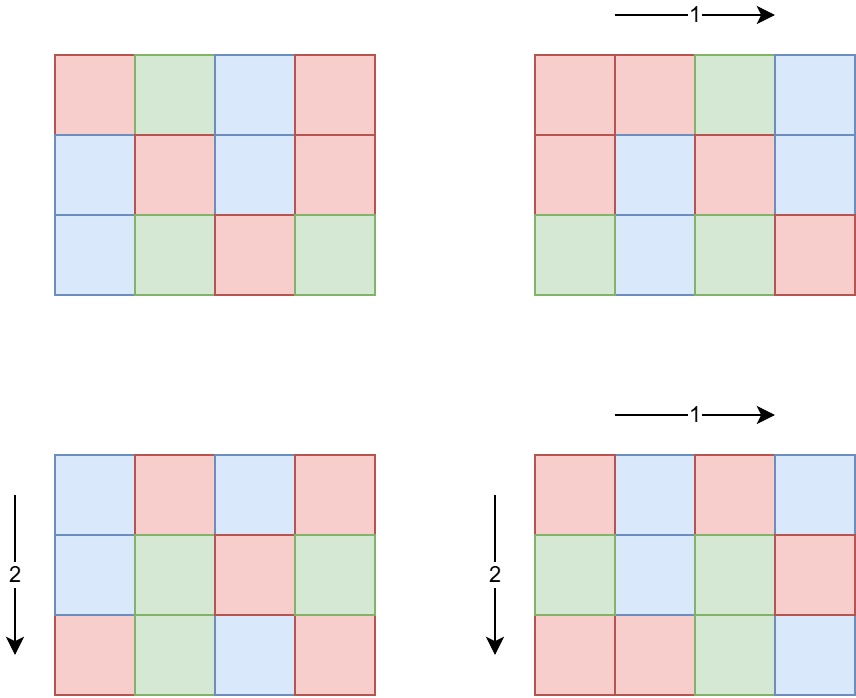
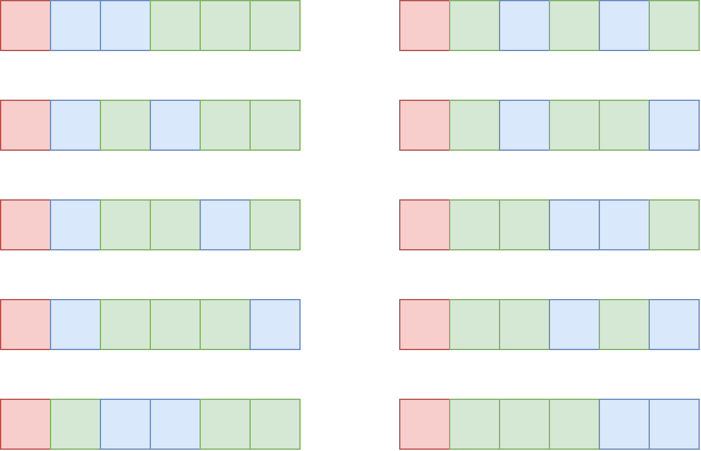

# F. Number of Cubes

**time limit per test:** 5 seconds

**memory limit per test:** 256 megabytes

**input:** standard input

**output:** standard output

Consider a rectangular parallelepiped with sides $a$, $b$, and $c$, that consists of unit cubes of $k$ different colors. We can apply cyclic shifts to the parallelepiped in any of the three directions any number of times$^{\text{∗}}$.

There are $d_i$ cubes of the $i$-th color ($1 \le i \le k$). How many different parallelepipeds (with the given sides) can be formed from these cubes, no two of which can be made equal by some combination of cyclic shifts?

$^{\text{∗}}$On the image:

- Top left shows the top view of the original parallelepiped. Lower layers will shift in the same way as the top layer.
- Top right shows the top view of a parallelepiped shifted to the right by $1$.
- Bottom left shows the top view of a parallelepiped shifted down by $2$.
- Bottom right shows the top view of a parallelepiped shifted to the right by $1$ and down by $2$.





#### Input

Each test contains multiple test cases. The first line contains the number of test cases $t$ ($1 \le t \le 100$). The description of the test cases follows.

The first line of each test case contains four integers: $a$, $b$, $c$, and $k$ ($1 \le a, b, c \le 3 \cdot 10^6$; $a \cdot b \cdot c \le 3 \cdot 10^6$; $1 \le k \le 10^6$) — three sides of the parallelepiped and the number of colors of unit cubes.

The second line of each test case contains $k$ integers $d_1, d_2, \ldots, d_k$ ($1 \le d_1 \le d_2 \le \ldots \le d_k \le 3 \cdot 10^6$) — the elements of the array $d$: the number of cubes of a given color.

It is guaranteed that in each test case the sum of the elements of the array $d$ is equal to $a \cdot b \cdot c$.

It is guaranteed that the sum of $k$ over all test cases does not exceed $10 ^ 6$.

#### Output

For each test case, print one integer — the number of different parallelepipeds modulo $998\,244\,353$.

#### Example

#### Input
```
6
1 1 1 1
1
6 1 1 3
1 2 3
12 1 1 3
2 4 6
3 3 1 2
3 6
2 3 3 2
6 12
72 60 96 4
17280 86400 120960 190080
```

#### Output
```
1
10
1160
12
1044
231490207
```

#### Note

In the first test case, there is only one parallelepiped, which consists of one unit cube.
 Possible parallelepipeds in the second test case


