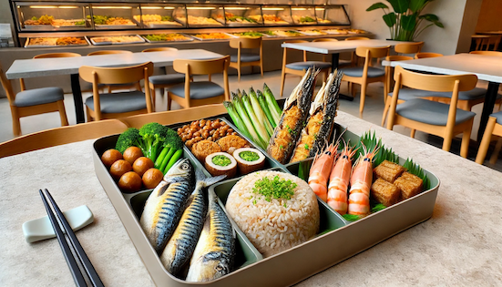

# A. The Bento Box Adventure

**time limit per test:** 1 second

**memory limit per test:** 1024 megabytes

**input:** standard input

**output:** standard output




 Image generated by ChatGPT 4o.
Boxed meals in Taiwan are very common, offering convenient and affordable nutrition-balanced choices for students and office workers. These meals typically include a variety of vegetables, protein, and rice, providing a well-rounded diet. With numerous options available at local self-service restaurants, they are a popular choice for those looking for a quick, healthy lunch.

There are five Taiwanese self-service restaurants numbered from 1 to 5. You plan to visit a different restaurant each day from Monday to Friday to pack a boxed meal for lunch. You've already visited one restaurant from Monday to Thursday, each time visiting a different one. Now, it's Friday, and you want to visit the last remaining restaurant that you haven't been to yet this week.

Write a program that takes as input the four restaurants you've already visited (one for each day from Monday to Thursday) and outputs the restaurant you should visit on Friday.

#### Input

A single line of input containing four integers $a, b, c, d$, each between 1 and 5 (inclusive), representing the restaurant numbers you visited from Monday to Thursday, in order.

- $1\le a, b, c, d\le 5$
- All four numbers will be different.

#### Output

Output the restaurant number you should visit on Friday.

#### Examples

#### Input
```
1 3 2 5
```

#### Output
```
4
```

#### Input
```
2 5 4 3
```

#### Output
```
1
```
