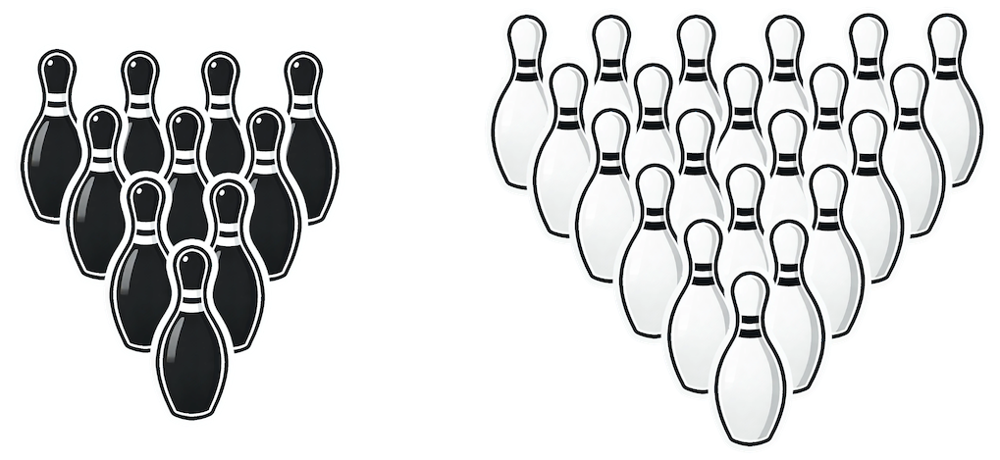
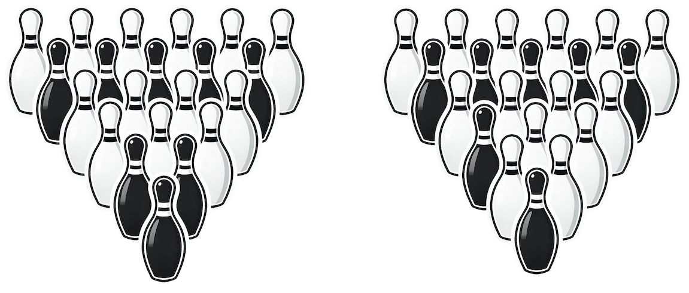

# B. Bowling Frame

**time limit per test:** 1 second

**memory limit per test:** 1024 megabytes

**input:** standard input

**output:** standard output

Bowling is a national sport in Taiwan; everyone in the country plays the sport on a daily basis since their youth. Naturally, there are a lot of bowling alleys all over the country, and the competition between them is as intense as you can imagine.

Maw-Shang owns one such bowling alley. To stand out from other competitors in the industry and draw attention from customers, he decided to hold a special event every month that features various unorthodox bowling rules. For the event this month, he came up with a new version of the game called X-pin bowling. In the traditional $10$-pin bowling game, a frame is built out of ten bowling pins forming a triangular shape of side length four. The pin closest to the player forms the first row, and the two pins behind it form the second row, and so on. Unlike the standard version, the game of $X$-pin bowling Maw-Shang designed allows a much larger number of pins that form a larger frame. The following figure shows a standard $10$-pin frame on the left, and on the right it shows a $21$-pin frame that forms a triangular shape of side length six which is allowed in the game of $X$-pin bowling.





Being the national sport, the government of Taiwan strictly regulates and standardizes the manufacturing of bowling pins. There are two types of bowling pins allowed, one in black and the other in white, and the bowling alley Maw-Shang owns has $w$ white pins and $b$ black pins. To make this new game exciting for the customers, Maw-Shang wants to build the largest possible frame from these $w+b$ pins. However, even though he is okay with using both colors in building the frame, for aesthetic reasons, Maw-Shang still wants the colors of the pins on the same row to be identical. For example, the following figure shows two possible frames of side length six, but only the left one is acceptable to Maw-Shang since the other one has white and black pins mixed in the third row.





The monthly special event is happening in just a few hours. Please help Maw-Shang calculate the side length of the largest frame that he can build from his $w+b$ pins!

#### Input

The first line of the input contains a single integer $t$, the number of test cases. Each of the following $t$ lines contains two integers $w$ and $b$, the number of white and black pins, respectively.

- $1 \leq t \leq 100$
- $0 \leq w, b \leq 10^9$

#### Output

For each test case, output in a single line the side length $k$ of the largest pin satisfying Maw-Shang's requirement you can build with the given pins.

#### Example

#### Input
```
4
1 2
3 2
3 3
12 0
```

#### Output
```
2
2
3
4
```
