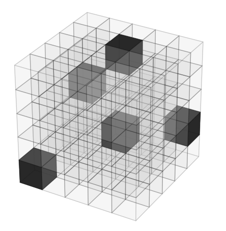

# C. Cube

**time limit per test:** 3 seconds

**memory limit per test:** 1024 megabytes

**input:** standard input

**output:** standard output





You are given an $n\times n\times n$ big three-dimensional cube that contains $n^3$ numbers. You have to choose $n$ of those numbers so that their sum is as small as possible. It is, however, forbidden to choose two numbers that are located in the same plane. That is, if we identify the positions in the cube by three Cartesian coordinates, then choosing two numbers from positions $(x,y,z)$ and $(x',y',z')$ is forbidden if $x=x'$, $y=y'$, or $z=z'$.

#### Input

The input consists of the number $n$ followed by $n^3$ numbers in the cube. The numbers are presented as $n$ two-dimensional matrices, one for each layer of the cube. More precisely, there will be $n^2$ lines follow, each having $n$ numbers. For each $x, y, z$ ($1\le x, y, z\le n$), the number at the position $(x, y, z)$ is listed as the $z$-th number in the $((x-1)\times n+y)$-th line.

- $2 \leq n \leq 12$
- All numbers in the cube are integers between $0$ and $2\times 10^7$.

#### Output

The output consists of a single number. It is the minimum sum of $n$ numbers chosen from the cube according to the above rules.

#### Example

#### Input
```
3
1 2 3
4 5 6
7 8 9
1 1 1
2 2 2
3 3 3
4 3 0
2 1 4
9 8 9
```

#### Output
```
5
```
