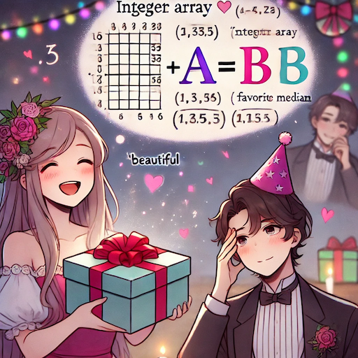

# E. Beautiful Array

**time limit per test:** 1 second

**memory limit per test:** 1024 megabytes

**input:** standard input

**output:** standard output




 Image generated by ChatGPT 4o.
A-Ming's birthday is coming and his friend A-May decided to give him an integer array as a present. A-Ming has two favorite numbers $a$ and $b$, and he thinks an array is beautiful if its mean is exactly $a$ and its median is exactly $b$. Please help A-May find a beautiful array so her gift can impress A-Ming.

The mean of an array is its sum divided by its length. For example, the mean of array $[3, -1, 5, 5]$ is $12 \div 4 = 3$.

The median of an array is its middle element after sorting if its length is odd, or the mean of two middle elements after sorting if its length is even. For example, the median of $[1, 1, 2, 4, 8]$ is $2$ and the median of $[3, -1, 5, 5]$ is $(3 + 5) \div 2 = 4$.

Note that the mean and median are not rounded to an integer. For example, the mean of array $[1, 2]$ is $1.5$.

#### Input

The only line contains two integers $a$ and $b$.

- $-100 \leq a, b \leq 100$.
- The length of the array must be between $1$ and $1000$.
- The elements of the array must be integers and their absolute values must not exceed $10^6$.

#### Output

In the first line, print the length of the array.

In the second line, print the elements of the array.

If there are multiple solutions, you can print any. It can be proved that, under the constraints of the problem, a solution always exists.

#### Examples

#### Input
```
3 4
```

#### Output
```
4
3 -1 5 5
```

#### Input
```
-100 -100
```

#### Output
```
1
-100
```
