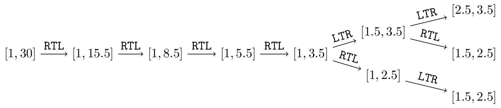

# F. Segmentation Folds

**time limit per test:** 1 second

**memory limit per test:** 1024 megabytes

**input:** standard input

**output:** standard output

Peter loves folding segments. There is a segment on a number line occupying the interval $[\ell, r]$. Since it is the prime time for folding the segments, Peter decides to fold the segment carefully. In each step, he chooses one of the two following operations whenever possible:

- Operation $\tt{LTR}$: he folds the segment from left to right, where $\ell$ coincides with a point $x$ ($\ell \lt x \le r$) such that $\ell+x$ is a prime number$^{\text{∗}}$. When Peter chooses this operation, he always chooses the largest possible value $x$. Note that the segment occupies the interval $[\frac{1}{2}(\ell+x), r]$ afterwards.
- Operation $\tt{RTL}$: he folds the segment from right to left, where $r$ coincides with a point $x$ ($\ell \le x \lt r$) such that $r+x$ is a prime number. When Peter chooses this operation, he always chooses the smallest possible value $x$. Note that the segment occupies the interval $[\ell, \frac{1}{2}(r+x)]$ afterwards.

A folding sequence refers to a sequence of operations specified above. Peter wants to fold the segment several times, resulting in the shortest possible interval whose length that cannot be further reduced. The length of an interval $[\ell, r]$ is defined naturally to be $r-\ell$. Let's consider the following example. Suppose that we are folding a segment initially occupying the interval $[1, 30]$. There are three folding sequences that lead to the shortest possible resulting interval, as shown in the following figure.





Please help Peter determine the number of folding sequences such that the resulting interval has a shortest possible length. Output the number modulo $998244353$.

$^{\text{∗}}$Recall that an integer $p \gt 1$ is a prime number if there do not exist integers $a, b \gt 1$ such that $p=ab$.

#### Input

The first line contains an integer $t$, denoting the number of test cases. In each of the following $t$ lines, there are two integers $\ell$ and $r$.

- $1 \le t \le 10$
- $1 \le \ell \lt r \le 10^{12}$
- $r - \ell \le 10^5$

#### Output

For each test case, please output a line denoting the number of ways to fold the given segment such that the resulting segment has the shortest possible length, modulo $998244353$.

#### Example

#### Input
```
3
1 30
16 18
142857 240135
```

#### Output
```
3
1
63
```
