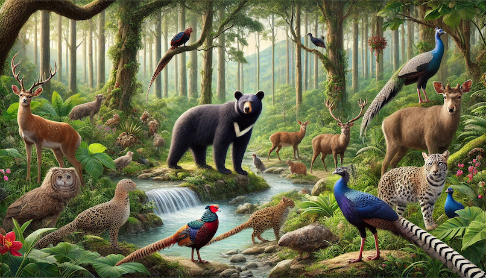

# K. Trophic Balance Species

**time limit per test:** 3 seconds

**memory limit per test:** 128 megabytes

**input:** standard input

**output:** standard output




 Image generated by ChatGPT 4o.
In an interdisciplinary collaboration, an ecosystem scientist and a computer scientist join forces to analyze the structure of a complex ecosystem using computational methods. The ecosystem scientist models the ecosystem as a directed graph $D = (V, A)$, where each species is represented by a node $v \in V$, and each feeding relationship is represented as a directed edge $(x, y) \in A$ from prey $x$ to predator $y$. This graph structure allows them to simulate the flow of energy throughout the ecosystem from one species to another.

Two essential features of the ecosystem are defined:

- Independent Trophic Group: A set $S$ of animal species is classified as an independent trophic group if no species $x \in S$ can reach another species $y \in S$ (for some $y \ne x$) through a series of directed feeding relationships, meaning there is no directed path in $D$ from $x$ to $y$.
- Trophic Balance Species: A species is termed a trophic balance species if it has a nearly equal number of species that affect it as directly or indirectly predators (species it can reach via a directed path in $D$, excluding itself) and species that affect it as directly or indirectly prey (species that can reach it via a directed path in $D$, excluding itself). Specifically, trophic balance species are those for which the absolute difference between the above two numbers is minimum among all species in the ecosystem.

Consider an ecosystem with $n = 4$ species and $m = 3$ feeding relationships:

- Species 1: Grass (Node 1)
- Species 2: Rabbits (Node 2)
- Species 3: Foxes (Node 3)
- Species 4: Hawks (Node 4)

The directed edges representing the feeding relationships are as follows:

- $(1, 2)$: Grass is eaten by Rabbits.
- $(2, 3)$: Rabbits are eaten by Foxes.
- $(2, 4)$: Rabbits are also eaten by Hawks.

Now, consider the set $S=\{3,4\}$ (Foxes and Hawks). There are no directed paths between Foxes (Node 3) and Hawks (Node 4); Foxes cannot reach Hawks, and Hawks cannot reach Foxes through any directed paths. Therefore, this set qualifies as an independent trophic group.

Examination of Species

- Species 1 (Grass):

 - Can reach: 3 (Rabbits, Foxes, and Hawks)
 - Can be reached by: 0 (None)
 - Absolute difference: $|3 - 0| = 3$

- Species 2 (Rabbits):

 - Can reach: 2 (Foxes and Hawks)
 - Can be reached by: 1 (Grass)
 - Absolute difference: $|2 - 1| = 1$

- Species 3 (Foxes):

 - Can reach: 0 (None)
 - Can be reached by: 2 (Grass and Rabbits)
 - Absolute difference: $|0-2| = 2$

- Species 4 (Hawks):

 - Can reach: 0 (None)
 - Can be reached by: 2 (Grass and Rabbits)
 - Absolute difference: $|0-2| = 2$


Among these species, Rabbits have the smallest absolute difference of $1$, indicating that they are a trophic balance species within the ecosystem.

It is known that any independent trophic group in the ecosystem has a size of at most $k$. The task is to find the set of all trophic balance species in the ecosystem.

#### Input

The first line contains exactly two integers $n$ and $m$, where $n$ (resp. $m$) denotes the number of nodes (resp. edges) in the directed graph $D$ induced by the investigated ecosystem. The nodes are numbered as $1, 2, \ldots, n$. Then, $m$ lines follow. The $i$-th line contains two integers $x_i$ and $y_i$ indicating a directed edge from node $x_i$ to node $y_i$.

- $1 \le n \le 2 \times 10^5$
- $0 \le m \le \min\{ n(n-1), 4 \times 10^5\}$
- $k$ is not an input value, and it is guaranteed that $1 \le k \le 16$ for each investigated ecosystem.
- For all $i$ ($1\le i\le m$), $1\le x_i, y_i\le n$ and $x_i\neq y_i$.
- Each ordered pair $(x_i, y_i)$ appears at most once in the input.

#### Output

Output on a single line the node identidiers of all trophic balance species in ascending order. For any two consecutive node identifiers, separate them by a space.

#### Examples

#### Input
```
4 3
1 2
2 3
2 4
```

#### Output
```
2
```

#### Input
```
4 5
1 2
1 3
1 4
2 3
3 2
```

#### Output
```
2 3 4
```
