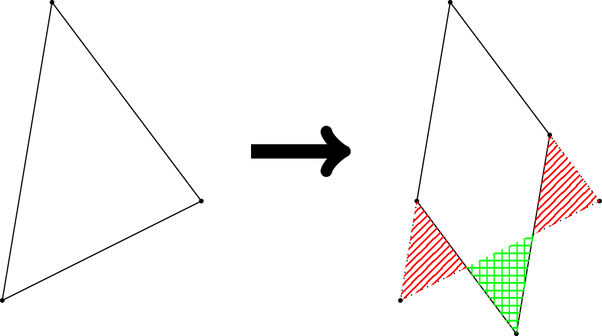

# L. Building Castle

**time limit per test:** 10 seconds

**memory limit per test:** 1024 megabytes

**input:** standard input

**output:** standard output

A-Ju has a gorgeous castle in which she often enjoys living. However, she gets tired of living in the castle for a long time. Thus, she decides to rebuild her castle into some specific shape to make her it more beautiful.

Let's say we represent A-Ju's castle as a 2D convex polygon$^{\text{∗}}$ on the 2D plane. A-Ju aims to rebuild her castle into a point symmetric convex polygon. Here, a polygon is point symmetric if there exists a center $c$ such that for every point $p$ in the polygon, the reflection $p^\prime$ of $p$ across $c$ is also in the polygon.

While designing an arbitrary point symmetric convex polygon shape is easy, the cost of rebuilding is very high. After some estimation, A-Ju found that the cost of rebuilding is proportional to the area of the symmetric difference$^{\text{†}}$ between the original castle and the new castle. See the following figure for an example:





In the example above, A-Ju's castle is a shape of the convex polygon formed by points $(3, 7) - (2, 1) - (6, 3)$. After rebuilding her castle into the shape of the polygon formed by $(3, 7) - (\frac{7}{3}, 3) - (\frac{13}{3}, \frac{1}{3}) - (5, \frac{13}{3})$, the area of the symmetric difference between these two polygons will be $\frac{11}{3}$. The difference can be calculated as the sum of the additional area (represented by the green grid region) and the shaved area (represented by the red line region).

Please write a program that helps A-Ju design a blueprint of the new castle, such that the area of the symmetric difference between the original one and the new one is minimized. You only need to output the minimum value since A-Ju wants to estimate her cost first.

$^{\text{∗}}$A polygon $P$ is convex if for every two points $p, q \in P$, the line segment connecting them is also contained in $P$, i.e., $tp + (1-t)q \in P$ for all $t \in [0, 1]$. Equivalently, it is a polygon whose interior angles are all less than $180^{\circ}$.

$^{\text{†}}$The symmetric difference of two polygons is the part of the 2D plane that belongs to exactly one polygon.

#### Input

The first line contains an integer $n$, representing the number of vertices of the polygon that forms A-Ju's castle.

Then, $n$ lines follow, the $i$-th of which contains two integers $x_i, y_i$, representing the coordinates of the $i$-th vertex. The vertices are given in a counterclockwise order.

- $3\leq n\leq 500$
- $|x_i|, |y_i|\leq 10^4$
- The vertices are given in a counterclockwise order and are guaranteed to form a convex polygon without three collinear points.

#### Output

Print a single real number in one line, representing the minimum area of the symmetric difference between the original castle and the new castle.

Your answer will be accepted if the absolute or relative error does not exceed $10^{-4}$. Formally, let your answer be $a$, and the jury's answer be $b$. Your answer is considered correct if $\frac{|a-b|}{\max(1,|b|)}\le 10^{-4}$.

#### Examples

#### Input
```
3
2 1
6 3
3 7
```

#### Output
```
3.666666666667
```

#### Input
```
4
0 0
5 0
5 5
0 5
```

#### Output
```
0.000000000000
```
