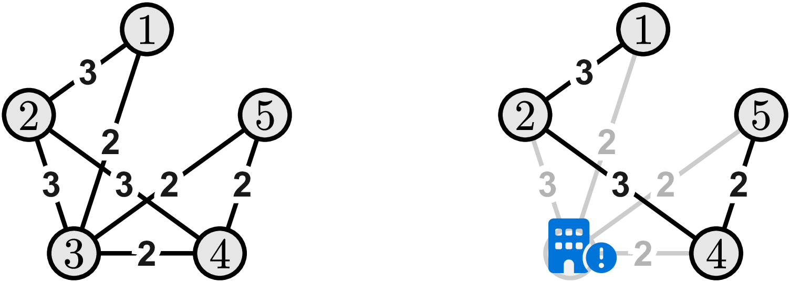

# N. Railway Construction

**time limit per test:** 4 seconds

**memory limit per test:** 1024 megabytes

**input:** standard input

**output:** standard output

The country of Truckski is located in a rugged, mountainous region, and the geological condition has engendered a wide range of issues. The challenging terrain separates the different states in the country, resulting in an extremely inconvenient inter-state commute and more crucially a lack of central governmental control. Adding on top of that is a rampant crime rate that increases annually, and this severely disrupts the everyday lives of innocent citizens.

A recent protest finally shed light on the situation, as the newly elected president has announced an ambitious project to resolve these issues. Her plan consists of two major components. The first is the construction of high-speed railways between the states to facilitate better connections and unity across the country. Since the states are mostly running independently from each other, to construct a railway between states $u$ and $v$, the government has to pay a fee of $a_u + a_v$ dollars, with $a_u$ dollars given to state $u$ and $a_v$ dollars given to state $v$. The railway operates bidirectionally, meaning that once it is built, people from state $u$ can now travel to state $v$ and vice versa. A railway can be built between almost any pair of states, except for $m$ particular pairs for which the terrain dividing them is so treacherous that the construction of a direct railroad between the two states becomes impossible.

The second component of the project is to build a centralized prison that manages all criminals across the country. Given the large number of estimated prisoners, the president decided to pick one of the states to build the central prison and sever the connection from the state to the rest of the country.




 An illustration for the sample input 1. (a) The costs of building direct railways between the states. (b) Consider building the central prison in State #3. All direct railroads that do not involve State #3 have to be built, with a total cost of $3+3+2=8$ dollars.
Given the above, the president would like to search for the minimum cost plan to construct railroads between the states so that:

- the state with the central prison should not have any railway connecting it to any other states, and
- all the other states should be connected, i.e., people should be able to travel from one such state to another, possibly by taking more than one train.

You are working for the team in charge of the overall planning of the construction. The meeting with the president is happening in just a few hours, at which time you will have to brief her on the cost of different construction plans. Please calculate, for each state $u$, the minimum cost plan to construct railroads between states meeting the above conditions when $u$ is where the central prison is built.

#### Input

The first line of the input contains two integers $n$ and $m$, the number of states in Truckski and the number of pairs for which railroad construction is not feasible. The next line contains $n$ integers $a_1, \ldots, a_n$, the construction fee the government needs to pay to the $i$-th state. Then, $m$ lines follow. The $i$-th line contains two integers $u_i$ and $v_i$ meaning that it is impossible to build a (direct) railway between states $u_i$ and $v_i$.

- $2\leq n\leq 10^5$
- $0\leq m\leq 10^5$
- $1\leq a_i\leq 10^9$
- $1\leq u_i \lt v_i\leq n$
- For all $i\neq j, (u_i, v_i)\neq (u_j, v_j)$.

#### Output

Output $n$ integers in one line. The $i$-th integer is the minimum construction cost when the $i$-th state is where the prison is built. If it is impossible to find a feasible railroad construction, output -1 instead.

#### Examples

#### Input
```
5 3
1 2 1 1 1
1 4
1 5
2 5
```

#### Output
```
7 6 8 7 7
```

#### Input
```
3 2
1 2 3
1 2
2 3
```

#### Output
```
-1 4 -1
```
