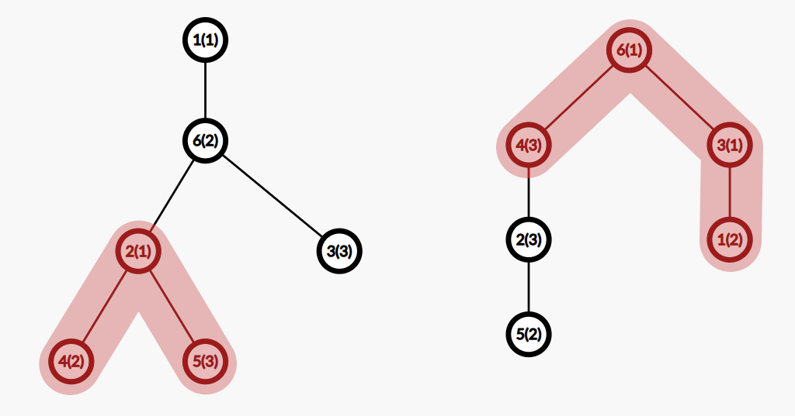

# E. Vertex Pairs

**time limit per test:** 3 seconds

**memory limit per test:** 512 megabytes

**input:** standard input

**output:** standard output

You are given a tree consisting of $2n$ vertices. Recall that a tree is a connected undirected graph with no cycles. Each vertex has an integer from $1$ to $n$ written on it. Each value from $1$ to $n$ is written on exactly two different vertices. Each vertex also has a cost —vertex $i$ costs $2^i$.

You need to choose a subset of vertices of the tree such that:

- the subset is connected; that is, from each vertex in the subset, you can reach every other vertex in the subset by passing only through the vertices in the subset;
- each value from $1$ to $n$ is written on at least one vertex in the subset.

Among all such subsets, you need to find the one with the smallest total cost of the vertices in it. Note that you are not required to minimize the number of vertices in the subset.

#### Input

The first line contains a single integer $n$ ($1 \le n \le 2 \cdot 10^5$).

The second line contains $2n$ integers $a_1, a_2, \dots, a_{2n}$ ($1 \le a_i \le n$). Each value from $1$ to $n$ appears exactly twice.

Each of the next $2n-1$ lines contains two integers $v$ and $u$ ($1 \le v, u \le 2n$) — the edges of the tree. These edges form a valid tree.

#### Output

In the first line, print a single integer $k$ — the number of vertices in the subset.

In the second line, print $k$ distinct integers from $1$ to $2n$ — the indices of the vertices in the chosen subset. The vertices can be printed in an arbitrary order.

#### Examples

#### Input
```
3
1 1 3 2 3 2
4 2
1 6
6 2
6 3
2 5
```

#### Output
```
3
2 4 5 
```

#### Input
```
3
2 3 1 3 2 1
6 4
2 4
5 2
3 6
3 1
```

#### Output
```
4
1 3 4 6 
```

#### Input
```
6
5 2 3 4 6 4 2 5 6 1 1 3
10 8
2 10
12 7
4 10
5 9
6 2
1 9
3 4
12 6
11 5
4 5
```

#### Output
```
6
2 3 4 5 8 10 
```

#### Note





The images show the answers to the first two examples. The numbers in parentheses are the values written on the vertices.

In the first example, there are valid subsets such as: $[2, 4, 5]$ (with a cost of $2^2 + 2^4 + 2^5 = 52$), $[2, 4, 5, 6]$ (with a cost of $116$), $[1, 6, 3]$ (with a cost of $74$), $[2, 6, 3]$ (with a cost of $76$), and many others.

In the second example, the cost of the subset $[4, 6, 3, 1]$ is $90$.
