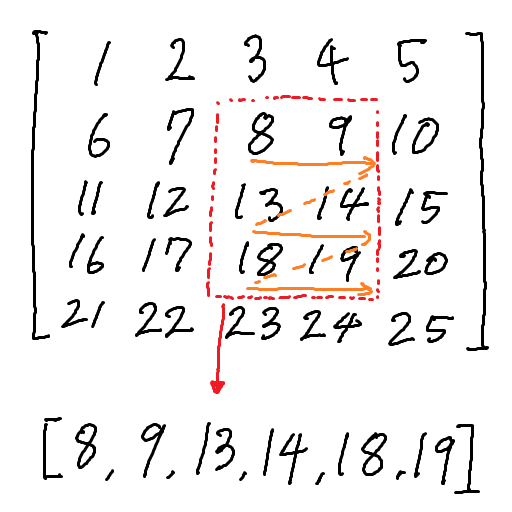

# H. Hard Demon Problem

**time limit per test:** 3.5 seconds

**memory limit per test:** 512 megabytes

**input:** standard input

**output:** standard output

Swing is opening a pancake factory! A good pancake factory must be good at flattening things, so Swing is going to test his new equipment on 2D matrices.

Swing is given an $n \times n$ matrix $M$ containing positive integers. He has $q$ queries to ask you.

For each query, he gives you four integers $x_1$, $y_1$, $x_2$, $y_2$ and asks you to flatten the submatrix bounded by $(x_1, y_1)$ and $(x_2, y_2)$ into an array $A$. Formally, $A = [M_{(x1,y1)}, M_{(x1,y1+1)}, \ldots, M_{(x1,y2)}, M_{(x1+1,y1)}, M_{(x1+1,y1+1)}, \ldots, M_{(x2,y2)}]$.

The following image depicts the flattening of a submatrix bounded by the red dotted lines. The orange arrows denote the direction that the elements of the submatrix are appended to the back of $A$, and $A$ is shown at the bottom of the image.





Afterwards, he asks you for the value of $\sum_{i=1}^{|A|} A_i \cdot i$ (sum of $A_i \cdot i$ over all $i$).

#### Input

The first line contains an integer $t$ ($1 \leq t \leq 10^3$) — the number of test cases.

The first line of each test contains two integers $n$ and $q$ ($1 \leq n \leq 2000, 1 \leq q \leq 10^6$) — the length of $M$ and the number of queries.

The following $n$ lines contain $n$ integers each, the $i$'th of which contains $M_{(i,1)}, M_{(i,2)}, \ldots, M_{(i,n)}$ ($1 \leq M_{(i, j)} \leq 10^6$).

The following $q$ lines contain four integers $x_1$, $y_1$, $x_2$, and $y_2$ ($1 \leq x_1 \leq x_2 \leq n, 1 \leq y_1 \leq y_2 \leq n$) — the bounds of the query.

It is guaranteed that the sum of $n$ over all test cases does not exceed $2000$ and the sum of $q$ over all test cases does not exceed $10^6$.

#### Output

For each test case, output the results of the $q$ queries on a new line.

#### Example

#### Input
```
2
4 3
1 5 2 4
4 9 5 3
4 5 2 3
1 5 5 2
1 1 4 4
2 2 3 3
1 2 4 3
3 3
1 2 3
4 5 6
7 8 9
1 1 1 3
1 3 3 3
2 2 2 2
```

#### Output
```
500 42 168 
14 42 5 
```

#### Note

In the second query of the first test case, $A = [9, 5, 5, 2]$. Therefore, the sum is $1 \cdot 9 + 2 \cdot 5 + 3 \cdot 5 + 4 \cdot 2 = 42$.
