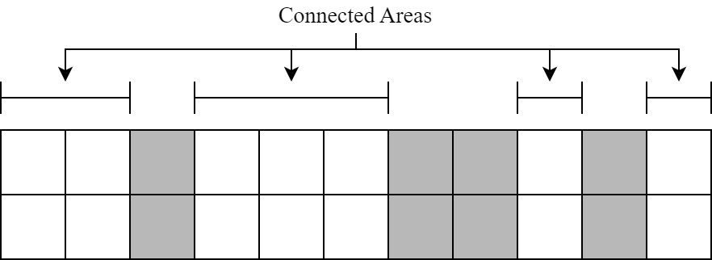
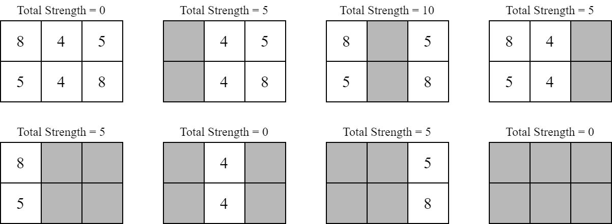

# E. Narrower Passageway

**time limit per test:** 1 second

**memory limit per test:** 1024 megabytes

**input:** standard input

**output:** standard output

You are a strategist of The ICPC Kingdom. You received an intel that there will be monster attacks on a narrow passageway near the kingdom. The narrow passageway can be represented as a grid with $2$ rows (numbered from $1$ to $2$) and $N$ columns (numbered from $1$ to $N$). Denote $(r, c)$ as the cell in row $r$ and column $c$. A soldier with a power of $P_{r, c}$ is assigned to protect $(r, c)$ every single day.

It is known that the passageway is very foggy. Within a day, each column in the passageway has a $50\%$ chance of being covered in fog. If a column is covered in fog, the two soldiers assigned to that column are not deployed that day. Otherwise, the assigned soldiers will be deployed.

Define a connected area $[u, v]$ ($u \leq v$) as a maximal set of consecutive columns from $u$ to $v$ (inclusive) such that each column in the set is not covered in fog. The following illustration is an example of connected areas. The grayed cells are cells covered in fog. There are $4$ connected areas: $[1, 2]$, $[4, 6]$, $[9, 9]$, and $[11, 11]$.





The strength of a connected area $[u, v]$ can be calculated as follows. Let $m_1$ and $m_2$ be the maximum power of the soldiers in the first and second rows of the connected area, respectively. Formally, $m_r = \max (P_{r, u}, P_{r, u + 1}, \dots, P_{r, v})$ for $r \in \{ 1, 2\}$. If $m_1 = m_2$, then the strength is $0$. Otherwise, the strength is $\min (m_1, m_2)$.

The total strength of the deployment is the sum of the strengths for all connected areas. Determine the expected total strength of the deployment on any single day.

#### Input

The first line consists of an integer $N$ ($1 \leq N \leq 100\,000$).

Each of the next two lines consists of $N$ integers $P_{r, c}$ ($1 \leq P_{r, c} \leq 200\,000$).

#### Output

Let $M = 998\,244\,353$. It can be shown that the expected total strength can be expressed as an irreducible fraction $\frac{x}{y}$ such that $x$ and $y$ are integers and $y \not\equiv 0 \pmod{M}$. Output an integer $k$ in a single line such that $0 \leq k \lt M$ and $k \cdot y \equiv x \pmod{M}$.

#### Examples

#### Input
```
3
8 4 5
5 4 8
```

#### Output
```
249561092
```

#### Input
```
5
10 20 5 8 5
5 20 7 5 8
```

#### Output
```
811073541
```

#### Note

Explanation for the sample input/output #1

There are $8$ possible scenarios for the passageway.





Each scenario is equally likely to happen. Therefore, the expected total strength is $(0 + 5 + 10 + 5 + 5 + 0 + 5 + 0) / 8 = \frac{15}{4}$. Since $249\,561\,092 \cdot 4 \equiv 15 \pmod{998\,244\,353}$, the output of this sample is $249\,561\,092$.

Explanation for the sample input/output #2

The expected total strength is $\frac{67}{16}$.
