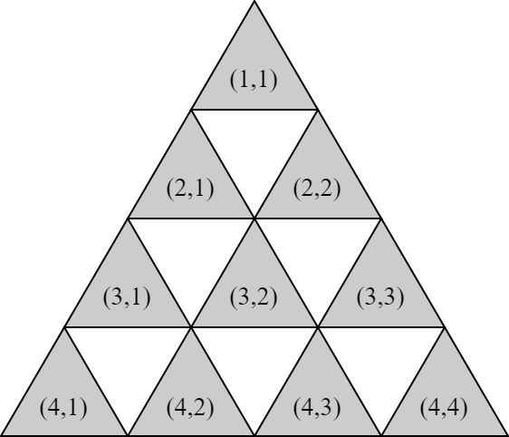
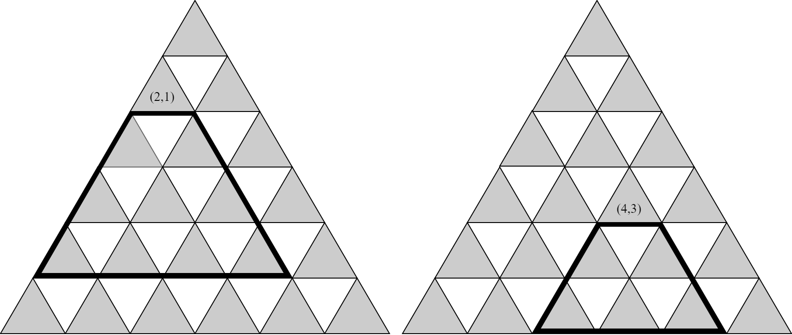

# F. Grid Game 3-angle

**time limit per test:** 1 second

**memory limit per test:** 1024 megabytes

**input:** standard input

**output:** standard output

Your friends, Anda and Kamu decide to play a game called Grid Game and ask you to become the gamemaster. As the gamemaster, you set up a triangular grid of size $N$. The grid has $N$ rows (numbered from $1$ to $N$). Row $r$ has $r$ cells; the $c$-th cell of row $r$ is denoted as $(r, c)$.





Before the game starts, $M$ different cells (numbered from $1$ to $M$) are chosen: at cell $(R_i, C_i)$, you add $A_i$ stones on it. You then give Anda and Kamu an integer $K$ and commence the game.

Anda and Kamu will take turns alternately with Anda taking the first turn. A player on their turn will do the following.

- Choose a cell $(r, c)$ with at least one stone on it.
- Remove at least one but at most $K$ stones from the chosen cell.
- For each cell $(x, y)$ such that $r + 1 \leq x \leq \min(N, r + K)$ and $c \leq y \leq c + x - r$, add zero or more stones but at most $K$ stones to cell $(x, y)$.

The following illustrations show all the possible cells in which you can add stones for $K = 3$. You choose the cell $(2, 1)$ for the left illustration and the cell $(4, 3)$ for the right illustration.





A player who is unable to complete their turn (because there are no more stones on the grid) will lose the game, and the opposing player wins. Determine who will win the game if both players play optimally.

#### Input

This problem is a multi-case problem. The first line consists of an integer $T$ ($1 \leq T \leq 100$) that represents the number of test cases.

Each test case starts with a single line consisting of three integers $N$ $M$ $K$ ($1 \leq N \leq 10^9; 1 \leq M, K \leq 200\,000$). Then, each of the next $M$ lines consists of three integers $R_i$ $C_i$ $A_i$ ($1 \leq C_i \leq R_i \leq N; 1 \leq A_i \leq 10^9$). The pairs $(R_i, C_i)$ are distinct.

The sum of $M$ across all test cases does not exceed $200\,000$.

#### Output

For each case, output a string in a single line representing the player who will win the game if both players play optimally. Output Anda if Anda, the first player, wins. Otherwise, output Kamu.

#### Example

#### Input
```
3
2 2 4
1 1 3
2 1 2
100 2 1
4 1 10
4 4 10
10 5 2
1 1 4
3 1 2
4 2 5
2 2 1
5 3 4
```

#### Output
```
Anda
Kamu
Anda
```

#### Note

Explanation for the sample input/output #1

For the first case, during the first turn, Anda will remove all the stones from cell $(1, 1)$ and then add three stones at $(2, 1)$. The only cell with stones left is now cell $(2, 1)$ with five stones, so Kamu must remove stones from that cell. No matter how many stones are removed by Kamu, Anda can remove all the remaining stones at $(2, 1)$ and win the game.

For the second case, Kamu can always mirror whatever move made by Anda until Anda can no longer complete their turn.
