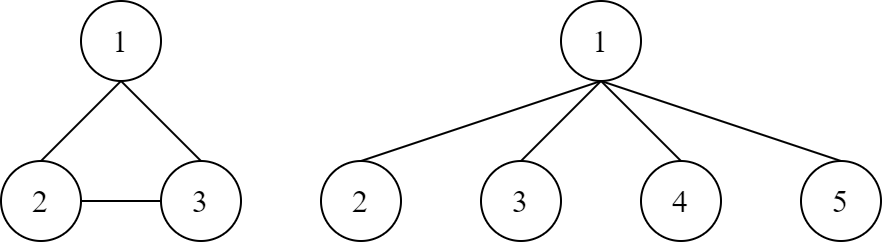
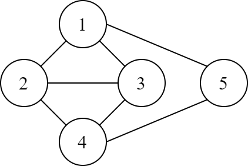

# L. Buggy DFS

**time limit per test:** 1 second

**memory limit per test:** 1024 megabytes

**input:** standard input

**output:** standard output

You are currently studying a graph traversal algorithm called the Depth First Search (DFS). However, due to a bug, your algorithm is slightly different from the standard DFS. The following is an algorithm for your Buggy DFS (BDFS), assuming the graph has $N$ nodes (numbered from $1$ to $N$).
```
  BDFS():
    let S be an empty stack
    let FLAG be a boolean array of size N which are all false initially
    let counter be an integer initialized with 0

    push 1 to S

    while S is not empty:
      pop the top element of S into u
      FLAG[u] = true

      for each v neighbour of u in ascending order:
        counter = counter + 1
        if FLAG[v] is false:
          push v to S

    return counter
```

You realized that the bug made the algorithm slower than standard DFS, which can be investigated by the return value of the function BDFS(). To investigate the behavior of this algorithm, you want to make some test cases by constructing an undirected simple graph such that the function BDFS() returns $K$, or determine if it is impossible to do so.

#### Input

A single line consisting of an integer $K$ ($1 \leq K \leq 10^9$).

#### Output

If it is impossible to construct an undirected simple graph such that the function BDFS() returns $K$, then output -1 -1 in a single line.

Otherwise, output the graph in the following format. The first line consists of two integers $N$ and $M$, representing the number of nodes and undirected edges in the graph, respectively. Each of the next $M$ lines consists of two integers $u$ and $v$, representing an undirected edge that connects node $u$ and node $v$. You are allowed to output the edges in any order. This graph has to satisfy the following constraints:

- $1 \leq N \leq 32\,768$
- $1 \leq M \leq 65\,536$
- $1 \leq u, v \leq N$, for all edges.
- The graph is a simple graph, i.e. there are no multi-edges nor self-loops.

Note that you are not required to minimize the number of nodes or edges. It can be proven that if constructing a graph in which the return value of BDFS() is $K$ is possible, then there exists one that satisfies all the constraints above. If there are several solutions, you can output any of them.

#### Examples

#### Input
```
8
```

#### Output
```
3 3
1 2
1 3
2 3
```

#### Input
```
1
```

#### Output
```
-1 -1
```

#### Input
```
23
```

#### Output
```
5 7
4 5
2 3
3 1
2 4
4 3
2 1
1 5
```

#### Note

Explanation for the sample input/output #1

The graph on the left describes the output of this sample. The graph on the right describes another valid solution for this sample.





Explanation for the sample input/output #3

The following graph describes the output of this sample.



