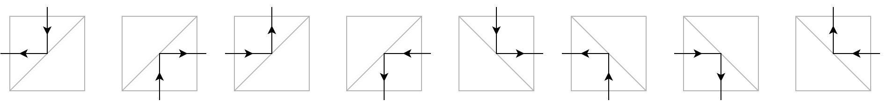
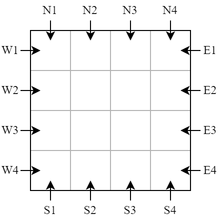
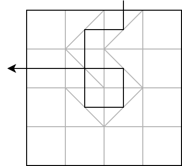
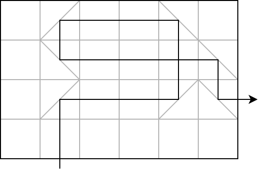

# M. Mirror Maze

**time limit per test:** 1 second

**memory limit per test:** 1024 megabytes

**input:** standard input

**output:** standard output

You are given a grid of $R$ rows (numbered from $1$ to $R$ from north to south) and $C$ columns (numbered from $1$ to $C$ from west to east). Every cell in this grid is a square of the same size. The cell located at row $r$ and column $c$ is denoted as $(r, c)$. Each cell can either be empty or have a mirror in one of the cell's diagonals. Each mirror is represented by a line segment. The mirror is type $1$ if it is positioned diagonally from the southwest corner to the northeast corner of the cell, or type $2$ for the other diagonal.

These mirrors follow the law of reflection, that is, the angle of reflection equals the angle of incidence. Formally, for type $1$ mirror, if a beam of light comes from the north, south, west, or east of the cell, then it will be reflected to the west, east, north, and south of the cell, respectively. Similarly, for type $2$ mirror, if a beam of light comes from the north, south, west, or east of the cell, then it will be reflected to the east, west, south, and north of the cell, respectively.





You want to put a laser from outside the grid such that all mirrors are hit by the laser beam. There are $2 \cdot (R+C)$ possible locations to put the laser:

- from the north side of the grid at column $c$, for $1 \leq c \leq C$, shooting a laser beam to the south;
- from the south side of the grid at column $c$, for $1 \leq c \leq C$, shooting a laser beam to the north;
- from the east side of the grid at row $r$, for $1 \leq r \leq R$, shooting a laser beam to the west; and
- from the west side of the grid at row $r$, for $1 \leq r \leq R$, shooting a laser beam to the east.





Determine all possible locations for the laser such that all mirrors are hit by the laser beam.

#### Input

The first line consists of two integers $R$ $C$ ($1 \leq R, C \leq 200$).

Each of the next $R$ lines consists of a string $S_r$ of length $C$. The $c$-th character of string $S_r$ represents cell $(r, c)$. Each character can either be . if the cell is empty, / if the cell has type $1$ mirror, or \ if the cell has type $2$ mirror. There is at least one mirror in the grid.

#### Output

Output a single integer representing the number of possible locations for the laser such that all mirrors are hit by the laser beam. Denote this number as $k$.

If $k \gt 0$, then output $k$ space-separated strings representing the location of the laser. Each string consists of a character followed without any space by an integer. The character represents the side of the grid, which could be N, S, E, or W if you put the laser on the north, south, east, or west side of the grid, respectively. The integer represents the row/column number. You can output the strings in any order.

#### Examples

#### Input
```
4 4
.//.
.\\.
.\/.
....
```

#### Output
```
2
N3 W2
```

#### Input
```
4 6
./..\.
.\...\
./../\
......
```

#### Output
```
2
E3 S2
```

#### Input
```
4 4
....
./\.
.\/.
....
```

#### Output
```
0
```

#### Note

Explanation for the sample input/output #1

The following illustration shows one of the solutions of this sample.





Explanation for the sample input/output #2

The following illustration shows one of the solutions of this sample.



