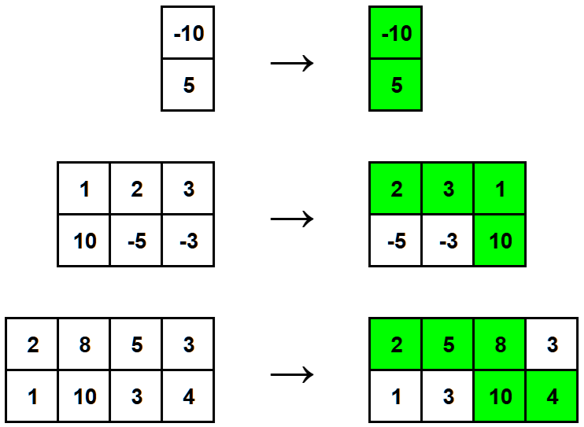

# A. Swap Columns and Find a Path

**time limit per test:** 2 seconds

**memory limit per test:** 512 megabytes

**input:** standard input

**output:** standard output


There is a matrix consisting of $2$ rows and $n$ columns. The rows are numbered from $1$ to $2$ from top to bottom; the columns are numbered from $1$ to $n$ from left to right. Let's denote the cell on the intersection of the $i$-th row and the $j$-th column as $(i,j)$. Each cell contains an integer; initially, the integer in the cell $(i,j)$ is $a_{i,j}$.

You can perform the following operation any number of times (possibly zero):

- choose two columns and swap them (i. e. choose two integers $x$ and $y$ such that $1 \le x \lt y \le n$, then swap $a_{1,x}$ with $a_{1,y}$, and then swap $a_{2,x}$ with $a_{2,y}$).

After performing the operations, you have to choose a path from the cell $(1,1)$ to the cell $(2,n)$. For every cell $(i,j)$ in the path except for the last, the next cell should be either $(i+1,j)$ or $(i,j+1)$. Obviously, the path cannot go outside the matrix.

The cost of the path is the sum of all integers in all $(n+1)$ cells belonging to the path. You have to perform the operations and choose a path so that its cost is maximum possible.

#### Input

Each test contains multiple test cases. The first line contains the number of test cases $t$ ($1 \le t \le 5000$). The description of the test cases follows.

Each test case consists of three lines:

- the first line contains one integer $n$ ($1 \le n \le 5000$) — the number of columns in the matrix;
- the second line contains $n$ integers $a_{1,1}, a_{1,2}, \ldots, a_{1,n}$ ($-10^5 \le a_{i,j} \le 10^5$) — the first row of the matrix;
- the third line contains $n$ integers $a_{2,1}, a_{2,2}, \ldots, a_{2,n}$ ($-10^5 \le a_{i,j} \le 10^5$) — the second row of the matrix.

It is guaranteed that the sum of $n$ over all test cases does not exceed $5000$.

#### Output

For each test case, print one integer — the maximum cost of a path you can obtain.

#### Example

#### Input
```
3
1
-10
5
3
1 2 3
10 -5 -3
4
2 8 5 3
1 10 3 4
```

#### Output
```
-5
16
29
```

#### Note

Here are the explanations of the first three test cases of the example. The left matrix is the matrix given in the input, the right one is the state of the matrix after several column swaps (possibly zero). The optimal path is highlighted in green.



