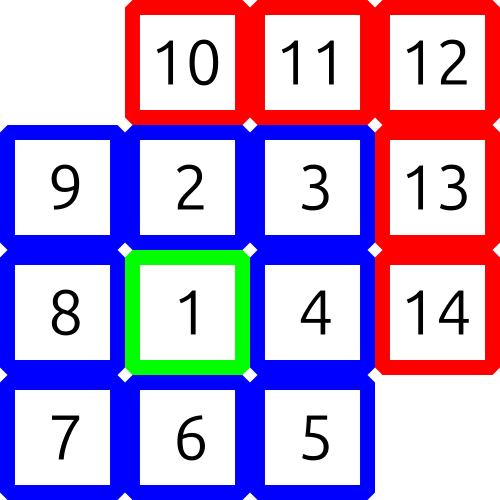

# A. Alyona and a Square Jigsaw Puzzle

**time limit per test:** 1 second

**memory limit per test:** 256 megabytes

**input:** standard input

**output:** standard output

Alyona assembles an unusual square Jigsaw Puzzle. She does so in $n$ days in the following manner:

- On the first day, she starts by placing the central piece in the center of the table.
- On each day after the first one, she places a certain number of pieces around the central piece in clockwise order, always finishing each square layer completely before starting a new one.

For example, she places the first $14$ pieces in the following order:




 The colors denote the layers. The third layer is still unfinished.
Alyona is happy if at the end of the day the assembled part of the puzzle does not have any started but unfinished layers. Given the number of pieces she assembles on each day, find the number of days Alyona is happy on.

#### Input

Each test contains multiple test cases. The first line contains the number of test cases $t$ ($1 \le t \le 500$). The description of the test cases follows.

The first line contains a single integer $n$ ($1 \le n \le 100$), the number of days.

The second line contains $n$ integers $a_1, a_2, \ldots, a_n$ ($1 \le a_i \le 100$, $a_1 = 1$), where $a_i$ is the number of pieces Alyona assembles on the $i$-th day.

It is guaranteed in each test case that at the end of the $n$ days, there are no unfinished layers.

#### Output

For each test case, print a single integer: the number of days when Alyona is happy.

#### Example

#### Input
```
5
1
1
2
1 8
5
1 3 2 1 2
7
1 2 1 10 2 7 2
14
1 10 10 100 1 1 10 1 10 2 10 2 10 1
```

#### Output
```
1
2
2
2
3
```

#### Note

In the first test case, in the only day Alyona finishes the only layer.

In the second test case, on the first day, Alyona finishes the first layer, and on the second day, she finishes the second layer.

In the third test case, she finishes the second layer in a few days.

In the fourth test case, she finishes the second layer and immediately starts the next one on the same day, therefore, she is not happy on that day. She is only happy on the first and last days.

In the fifth test case, Alyona is happy on the first, fourth, and last days.
