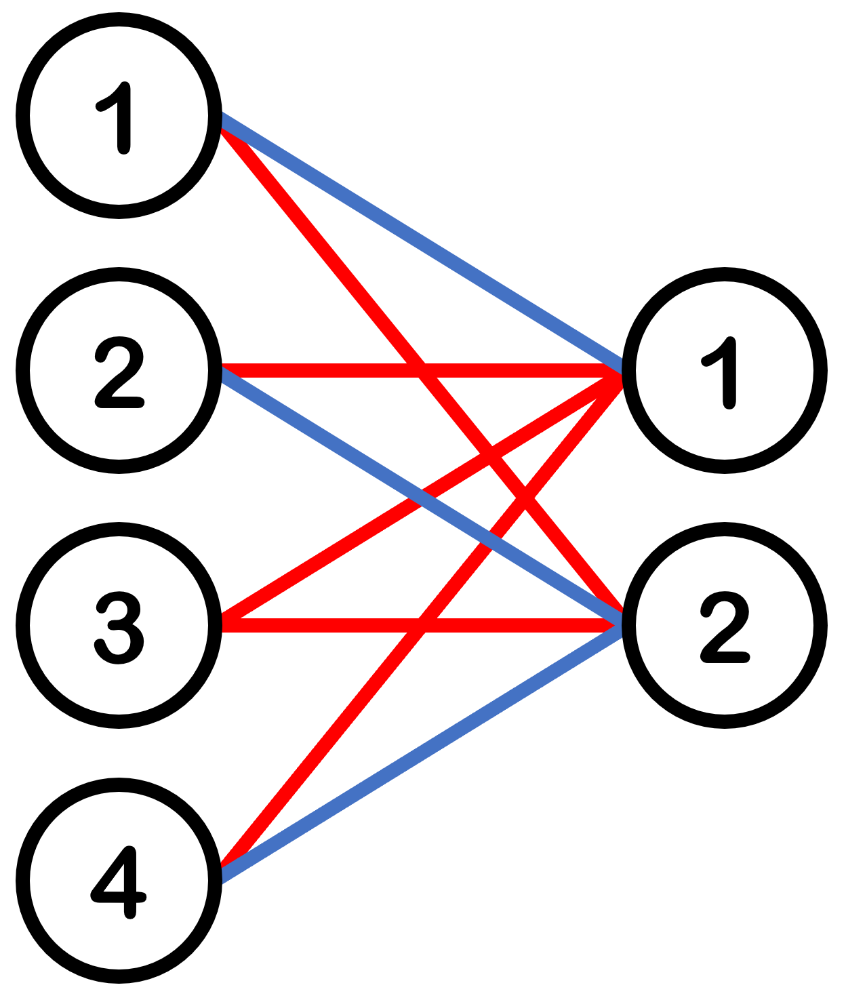

# E. Kevin and Bipartite Graph

**time limit per test:** 2 seconds

**memory limit per test:** 256 megabytes

**input:** standard input

**output:** standard output

The Arms Factory needs a poster design pattern and finds Kevin for help.

A poster design pattern is a bipartite graph with $ 2n $ vertices in the left part and $ m $ vertices in the right part, where there is an edge between each vertex in the left part and each vertex in the right part, resulting in a total of $ 2nm $ edges.

Kevin must color each edge with a positive integer in the range $ [1, n] $. A poster design pattern is good if there are no monochromatic cycles$^{\text{∗}}$ in the bipartite graph.

Kevin needs your assistance in constructing a good bipartite graph or informing him if it is impossible.

$^{\text{∗}}$A monochromatic cycle refers to a simple cycle in which all the edges are colored with the same color.

#### Input

Each test contains multiple test cases. The first line contains the number of test cases $ t $ ($ 1 \le t \le 100 $).

The only line of each test case contains two integers $ n $ and $ m $ ($ 1 \le n, m \leq 10^3 $) — the bipartite graph has $ 2n $ vertices in the left part and $ m $ vertices in the right part.

It is guaranteed that both the sum of $ n $ and the sum of $ m $ over all test cases do not exceed $ 10^3 $.

#### Output

For each test case, if there is no solution, then output No.

Otherwise, output Yes, and then output $ 2n $ lines, with each line containing $ m $ positive integers. The $ i $-th line's $ j $-th integer represents the color of the edge between the $ i $-th vertex in the left part and the $ j $-th vertex in the right part.

If there are multiple answers, you can print any of them.

You can output each letter in any case (for example, the strings yEs, yes, Yes, and YES will be recognized as a positive answer).

#### Example

#### Input
```
3
2 2
3 7
5 4
```

#### Output
```
YES
1 2
2 1
2 2
2 1
NO
YES
1 1 1 1
1 2 2 2
1 2 3 3
1 2 3 4
1 2 3 4
1 2 3 4
1 2 3 4
1 2 3 4
1 2 3 4
1 2 3 4
```

#### Note

For the first test case, the graph is shown as follows:





For the second test case, it can be proven that there is no valid solution.
