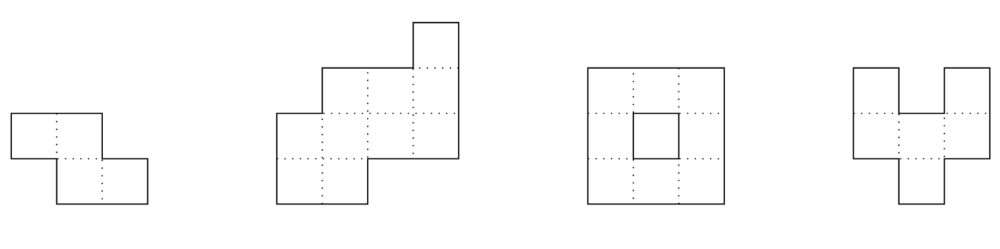
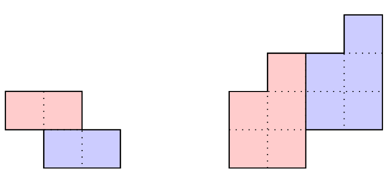
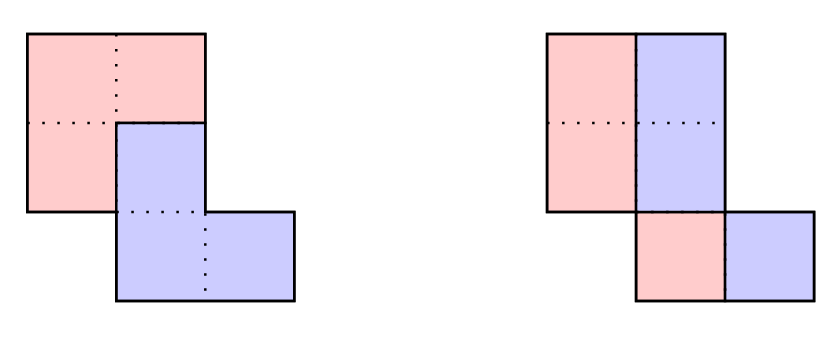
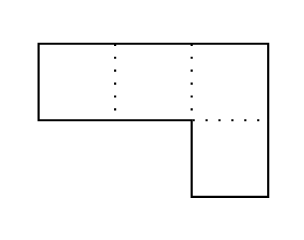

# F. Cosmic Divide

**time limit per test:** 4 seconds

**memory limit per test:** 256 megabytes

**input:** standard input

**output:** standard output


With the artifact in hand, the fabric of reality gives way to its true master — Florida Man.
A polyomino is a connected$^{\text{∗}}$ figure constructed by joining one or more equal $1 \times 1$ unit squares edge to edge. A polyomino is convex if, for any two squares in the polyomino that share the same row or the same column, all squares between them are also part of the polyomino. Below are four polyominoes, only the first and second of which are convex.





You are given a convex polyomino with $n$ rows and an even area. For each row $i$ from $1$ to $n$, the unit squares from column $l_i$ to column $r_i$ are part of the polyomino. In other words, there are $r_i - l_i + 1$ unit squares that are part of the polyomino in the $i$-th row: $(i, l_i), (i, l_i + 1), \ldots, (i, r_i-1), (i, r_i)$.

Two polyominoes are congruent if and only if you can make them fit exactly on top of each other by translating the polyominoes. Note that you are not allowed to rotate or reflect the polyominoes. Determine whether it is possible to partition the given convex polyomino into two disjoint connected polyominoes that are congruent to each other. The following examples illustrate a valid partition of each of the two convex polyominoes shown above:





The partitioned polyominoes do not need to be convex, and each unit square should belong to exactly one of the two partitioned polyominoes.

$^{\text{∗}}$A polyomino is connected if and only if for every two unit squares $u \neq v$ that are part of the polyomino, there exists a sequence of distinct squares $s_1, s_2, \ldots, s_k$, such that $s_1 = u$, $s_k = v$, $s_i$ are all part of the polyomino, and $s_i, s_{i+1}$ share an edge for each $1 \le i \le k - 1$.

#### Input

Each test contains multiple test cases. The first line contains the number of test cases $t$ ($1 \le t \le 10^4$). The description of the test cases follows.

The first line of each test case contains a single integer $n$ ($1\le n\le 2\cdot 10^5$) — the number of rows of the polyomino.

The $i$-th of the next $n$ lines contains two integers $l_i$ and $r_i$ ($1\le l_i\le r_i\le 10^9$) — the range of columns that are part of the polyomino in the $i$-th row.

It is guaranteed that the area of the polyomino is even. In other words, $\sum_{i=1}^n r_i - l_i + 1\equiv 0\pmod{2}$.

It is guaranteed that the sum of $n$ over all test cases does not exceed $2 \cdot 10^5$.

#### Output

For each test case, print a single line containing either "YES" or "NO", representing whether or not the polyomino can be partitioned as described in the problem.

You can output the answer in any case (upper or lower). For example, the strings "yEs", "yes", "Yes", and "YES" will be recognized as positive responses.

#### Example

#### Input
```
7
2
1 2
2 3
4
4 4
2 4
1 4
1 2
3
1 2
1 2
2 3
2
1 3
3 3
2
1 3
2 2
3
1 2
1 3
1 3
4
8 9
6 8
6 8
5 6
```

#### Output
```
YES
YES
NO
NO
NO
NO
YES
```

#### Note

The first and second test cases are the polyominoes depicted in the problem statement and can be partitioned as shown.

The polyomino in the third test case, shown below, can be shown to be impossible to partition. None of the following partitions are valid:





The partition on the left does not use polyominoes that are translations of each other, and the partition on the right does not use connected polyominoes.

The polyomino in the fourth test case, shown below, can be shown to be impossible to partition.





Note that while you can partition it into two $1 \times 2$ rectangles, these rectangles are not translations of each other.
