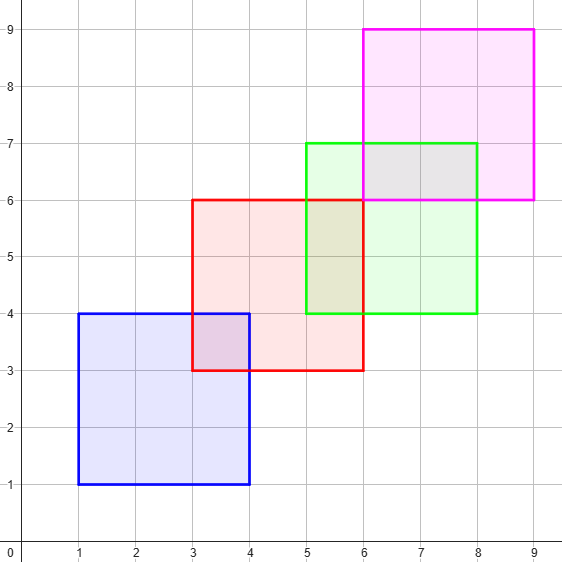
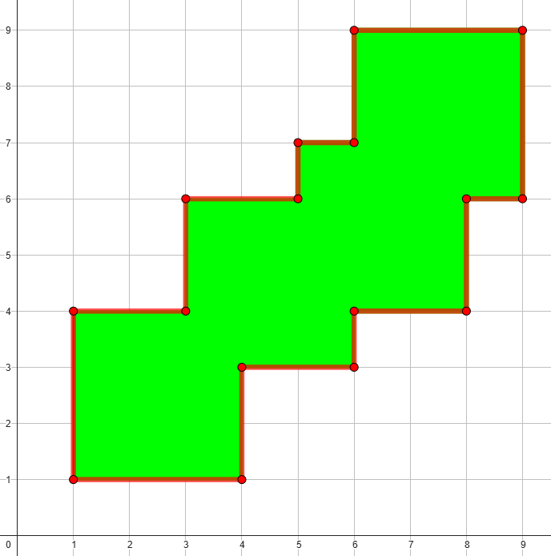

# A. Shape Perimeter

**time limit per test:** 1 second

**memory limit per test:** 256 megabytes

**input:** standard input

**output:** standard output

There is an $m$ by $m$ square stamp on an infinite piece of paper. Initially, the bottom-left corner of the square stamp is aligned with the bottom-left corner of the paper. You are given two integer sequences $x$ and $y$, each of length $n$. For each step $i$ from $1$ to $n$, the following happens:

- Move the stamp $x_i$ units to the right and $y_i$ units upwards.
- Press the stamp onto the paper, leaving an $m$ by $m$ colored square at its current position.

Note that the elements of sequences $x$ and $y$ have a special constraint: $1\le x_i, y_i\le m - 1$.

Note that you do not press the stamp at the bottom-left corner of the paper. Refer to the notes section for better understanding.

It can be proven that after all the operations, the colored shape on the paper formed by the stamp is a single connected region. Find the perimeter of this colored shape.

#### Input

Each test contains multiple test cases. The first line contains the number of test cases $t$ ($1 \le t \le 1000$). The description of the test cases follows.

The first line of each test case contains two integers $n$ and $m$ ($1 \le n \le 100$, $2 \le m \le 100$) — the number of operations performed and the side length of the square stamp.

The $i$-th of the next $n$ lines contains two integers $x_i$ and $y_i$ ($1 \le x_i, y_i \le m - 1$) — the distance that the stamp will be moved right and up during the $i$-th operation, respectively.

Note that there are no constraints on the sum of $n$ over all test cases.

#### Output

For each test case, output a single integer representing the perimeter of the colored shape on the paper.

#### Example

#### Input
```
3
4 3
1 1
2 2
2 1
1 2
1 2
1 1
6 7
3 6
1 1
3 1
6 6
5 4
6 1
```

#### Output
```
32
8
96
```

#### Note

In the first example, the stamp has a side length of $3$ and is pressed $4$ times at coordinates $(1, 1)$, $(3, 3)$, $(5, 4)$, and $(6, 6)$. The piece of paper looks like that afterwards:



Here, the square formed by the first press is colored blue, the second red, the third green, and the fourth purple. The combined shape, whose perimeter we need to calculate, looks like that:



From the diagram, it can be seen that this shape has a perimeter of $32$.
