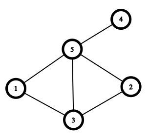

# B. Find the Permutation

**time limit per test:** 1.5 seconds

**memory limit per test:** 256 megabytes

**input:** standard input

**output:** standard output


You are given an undirected graph with $n$ vertices, labeled from $1$ to $n$. This graph encodes a hidden permutation$^{\text{∗}}$ $p$ of size $n$. The graph is constructed as follows:

- For every pair of integers $1 \le i \lt j \le n$, an undirected edge is added between vertex $p_i$ and vertex $p_j$ if and only if $p_i \lt p_j$. Note that the edge is not added between vertices $i$ and $j$, but between the vertices of their respective elements. Refer to the notes section for better understanding.

Your task is to reconstruct and output the permutation $p$. It can be proven that permutation $p$ can be uniquely determined.

$^{\text{∗}}$A permutation of length $n$ is an array consisting of $n$ distinct integers from $1$ to $n$ in arbitrary order. For example, $[2,3,1,5,4]$ is a permutation, but $[1,2,2]$ is not a permutation ($2$ appears twice in the array), and $[1,3,4]$ is also not a permutation ($n=3$ but there is $4$ in the array).

#### Input

Each test contains multiple test cases. The first line contains the number of test cases $t$ ($1 \le t \le 500$). The description of the test cases follows.

The first line of each test case contains a single integer $n$ ($1 \le n \le 1000$).

The $i$-th of the next $n$ lines contains a string of $n$ characters $g_{i, 1}g_{i, 2}\ldots g_{i, n}$ ($g_{i, j} = \mathtt{0}$ or $g_{i, j} = \mathtt{1}$) — the adjacency matrix. $g_{i, j} = \mathtt{1}$ if and only if there is an edge between vertex $i$ and vertex $j$.

It is guaranteed that there exists a permutation $p$ which generates the given graph. It is also guaranteed that the graph is undirected and has no self-loops, meaning $g_{i, j} = g_{j, i}$ and $g_{i, i} = \mathtt{0}$.

It is guaranteed that the sum of $n$ over all test cases does not exceed $1000$.

#### Output

For each test case, output $n$ integers $p_1, p_2, \ldots, p_n$ representing the reconstructed permutation.

#### Example

#### Input
```
3
1
0
5
00101
00101
11001
00001
11110
6
000000
000000
000000
000000
000000
000000
```

#### Output
```
1 
4 2 1 3 5 
6 5 4 3 2 1 
```

#### Note

In the first case $p = [1]$. Since there are no pairs $1 \le i \lt j \le n$, there are no edges in the graph.

The graph in the second case is shown below. For example, when we choose $i = 3$ and $j = 4$, we add an edge between vertices $p_i = 1$ and $p_j = 3$, because $p_i \lt p_j$. However, when we choose $i = 2$ and $j = 3$, $p_i = 2$ and $p_j = 1$, so $p_i \lt p_j$ doesn't hold. Therefore, we don't add an edge between $2$ and $1$.



In the third case, there are no edges in the graph, so there are no pairs of integers $1 \le i \lt j \le n$ such that $p_i \lt p_j$. Therefore, $p = [6, 5, 4, 3, 2, 1]$.
