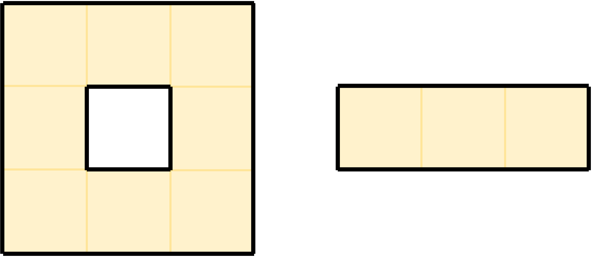

# G. Secret Message

**time limit per test:** 2 seconds

**memory limit per test:** 256 megabytes

**input:** standard input

**output:** standard output

Every Saturday, Alexander B., a teacher of parallel X, writes a secret message to Alexander G., a teacher of parallel B, in the evening. Since Alexander G. is giving a lecture at that time and the message is very important, Alexander B. has to write this message on an interactive online board.

The interactive online board is a grid consisting of $n$ rows and $m$ columns, where each cell is $1 \times 1$ in size. Some cells of this board are already filled in, and it is impossible to write a message in them; such cells are marked with the symbol ".", while the remaining cells are called free and are marked with the symbol "#".

Let us introduce two characteristics of the online board:

- $s$ is the number of free cells.
- $p$ is the perimeter of the grid figure formed by the union of free cells.

Let $A$ be the set of free cells. Your goal is to find a set of cells $S \subseteq A$ that satisfies the following properties:

- $|S| \le \frac{1}{5} \cdot (s+p)$.
- Any cell from $A$ either lies in $S$ or shares a side with some cell from $S$.

We can show that at least one set $S$ satisfying these properties exists; you are required to find any suitable one.

#### Input

The first line contains the number $t$ ($1 \le t \le 80\,000$) — the number of test cases.

In the first line of each test case, the numbers $n$ and $m$ ($1 \le n, m \le 2 \cdot 10^6$) — the dimensions of the grid are given.

The following $n$ lines contain the description of the grid.

It is guaranteed that the sum of $n \cdot m$ across all test cases does not exceed $2 \cdot 10^6$.

#### Output

For each test case, output $n$ lines consisting of $m$ symbols, where each symbol encodes the state of the cell:

- "#" — the cell is in $A$ but not in $S$;
- "S" — the cell is in both $A$ and $S$;
- "." — the cell is neither in $A$ nor in $S$.

#### Example

#### Input
```
3
3 3
.#.
###
.#.
2 6
######
######
3 7
###....
#.#.###
###....
```

#### Output
```
.#.
#S#
.#.
#S##S#
#S##S#
S#S....
#.#.S#S
S#S....
```

#### Note

In the first example, $s=5$ and $p=12$, thus the number of cells in $S$ must not exceed $\frac{1}{5} \cdot (5+12) = 3.4$, meaning $|S| \le 3$. Note that the presented set $S$ consists of $1$ cell and clearly satisfies all the constraints.

In the second example, $s=12$ and $p=16$, thus the number of cells in $S$ must not exceed $\frac{1}{5} \cdot (12+16)= 5.6$, meaning $|S| \le 5$. Note that the presented set $S$ consists of $4$ cells and clearly satisfies all the constraints.

In the third example, we will explain what perimeter is, as it may not be obvious. Any grid figure has a boundary, which can be represented as a union of segments that do not intersect at interior points. Thus, in the picture below, the thick black line denotes the boundary of the figure formed by the union of free cells. The total length of these segments is $p=24$.

At the same time, the value $s=11$ and the upper limit is $|S| \le 7$, the presented set has a size of $6$ and clearly satisfies all the constraints.



