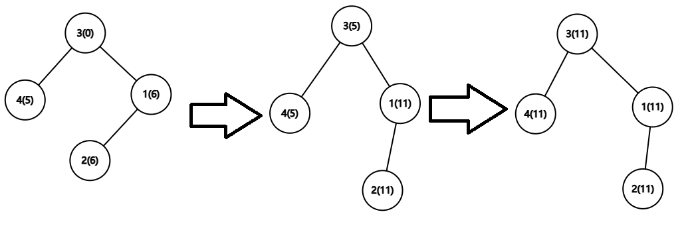

# D. Balanced Tree

**time limit per test:** 3 seconds

**memory limit per test:** 512 megabytes

**input:** standard input

**output:** standard output

You are given a tree$^{\text{∗}}$ with $n$ nodes and values $l_i, r_i$ for each node. You can choose an initial value $a_i$ satisfying $l_i\le a_i\le r_i$ for the $i$-th node. A tree is balanced if all node values are equal, and the value of a balanced tree is defined as the value of any node.

In one operation, you can choose two nodes $u$ and $v$, and increase the values of all nodes in the subtree$^{\text{†}}$ of node $v$ by $1$ while considering $u$ as the root of the entire tree. Note that $u$ may be equal to $v$.

Your goal is to perform a series of operations so that the tree becomes balanced. Find the minimum possible value of the tree after performing these operations. Note that you don't need to minimize the number of operations.

$^{\text{∗}}$A tree is a connected graph without cycles.

$^{\text{†}}$Node $w$ is considered in the subtree of node $v$ if any path from root $u$ to $w$ must go through $v$.

#### Input

The first line of input contains a single integer $t$ ($1 \leq t \leq 10^5$) — the number of input test cases.

The first line of each test case contains one integer $n$ ($1 \le n \le 2\cdot 10^5$) — the number of nodes in the tree.

Then $n$ lines follow. The $i$-th line contains two integers $l_i,r_i$ ($0\le l_i \le r_i\le 10^9$) — the constraint of the value of the $i$-th node.

The next $n-1$ lines contain the edges of the tree. The $i$-th line contains two integers $u_i,v_i$ ($1\le u_i,v_i \le n$, $u_i \neq v_i$) — an edge connecting $u_i$ and $v_i$. It is guaranteed that the given edges form a tree.

It is guaranteed that the sum of $n$ over all test cases does not exceed $2\cdot 10^5$.

#### Output

For each test case, output a single integer — the minimum possible value that all $a_i$ can be made equal to after performing the operations. It can be shown that the answer always exists.

#### Example

#### Input
```
6
4
0 11
6 6
0 0
5 5
2 1
3 1
4 3
7
1 1
0 5
0 5
2 2
2 2
2 2
2 2
1 2
1 3
2 4
2 5
3 6
3 7
4
1 1
1 1
1 1
0 0
1 4
2 4
3 4
7
0 20
0 20
0 20
0 20
3 3
4 4
5 5
1 2
1 3
1 4
2 5
3 6
4 7
5
1000000000 1000000000
0 0
1000000000 1000000000
0 0
1000000000 1000000000
3 2
2 1
1 4
4 5
6
21 88
57 81
98 99
61 76
15 50
23 67
2 1
3 2
4 3
5 3
6 4
```

#### Output
```
11
3
3
5
3000000000
98
```

#### Note

In the first test case, you can choose $a=[6,6,0,5]$.

You can perform the following operations to make all $a_i$ equal:

- Choose $u=4$, $v=3$ and perform the operation $5$ times.
- Choose $u=1$, $v=3$ and perform the operation $6$ times.

The complete process is shown as follows (where the numbers inside the parentheses are elements of $a$):



It can be proven that this is the optimal solution.
