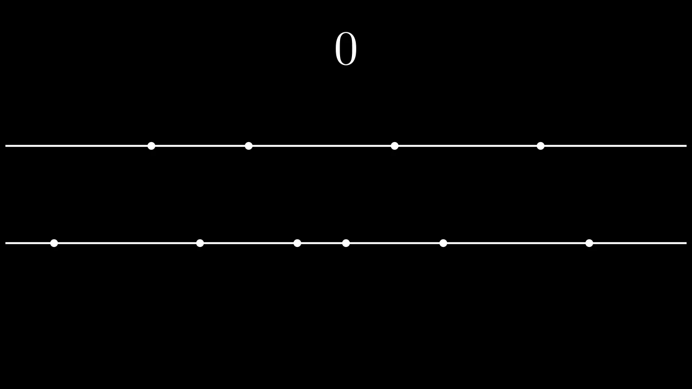

# D. Game With Triangles

**time limit per test:** 2 seconds

**memory limit per test:** 256 megabytes

**input:** standard input

**output:** standard output

 Even Little John needs money to buy a house. But he recently lost his job; how will he earn money now? Of course, by playing a game that gives him money as a reward! Oh well, maybe not those kinds of games you are thinking about.
There are $n+m$ distinct points $(a_1,0), (a_2,0), \ldots, (a_{n},0), (b_1,2), (b_2,2), \ldots, (b_{m},2)$ on the plane. Initially, your score is $0$. To increase your score, you can perform the following operation:

- Choose three distinct points which are not [collinear](<https://en.wikipedia.org/wiki/Collinearity>);
- Increase your score by the area of the triangle formed by these three points;
- Then, erase the three points from the plane.




 An instance of the game, where the operation is performed twice.
Let $k_{\max}$ be the maximum number of operations that can be performed. For example, if it is impossible to perform any operation, $k_\max$ is $0$. Additionally, define $f(k)$ as the maximum possible score achievable by performing the operation exactly $k$ times. Here, $f(k)$ is defined for all integers $k$ such that $0 \le k \le k_{\max}$.

Find the value of $k_{\max}$, and find the values of $f(x)$ for all integers $x=1,2,\ldots,k_{\max}$ independently.

#### Input

Each test contains multiple test cases. The first line contains the number of test cases $t$ ($1 \le t \le {3 \cdot 10^4}$). The description of the test cases follows.

The first line of each test case contains two integers $n$ and $m$ ($1 \le n,m \le 2 \cdot 10^5$).

The second line of each test case contains $n$ pairwise distinct integers $a_1,a_2,\ldots,a_{n}$ — the points on $y=0$ ($-10^9 \le a_i \le 10^9$).

The third line of each test case contains $m$ pairwise distinct integers $b_1,b_2,\ldots,b_{m}$ — the points on $y=2$ ($-10^9 \le b_i \le 10^9$).

It is guaranteed that both the sum of $n$ and the sum of $m$ over all test cases do not exceed $2 \cdot 10^5$.

#### Output

For each test case, given that the maximum number of operations is $k_{\max}$, you must output at most two lines:

- The first line contains the value of $k_{\max}$;
- The second line contains $k_{\max}$ integers denoting $f(1),f(2),\ldots,f(k_{\max})$. You are allowed to omit this line if $k_{\max}$ is $0$.

Note that under the constraints of this problem, it can be shown that all values of $f(x)$ are integers no greater than $10^{16}$.

#### Example

#### Input
```
5
1 3
0
0 1 -1
2 4
0 100
-100 -50 0 50
2 4
0 1000
-100 -50 0 50
6 6
20 1 27 100 43 42
100 84 1 24 22 77
8 2
564040265 -509489796 469913620 198872582 -400714529 553177666 131159391 -20796763
-1000000000 1000000000
```

#### Output
```
1
2
2
150 200
2
1000 200
4
99 198 260 283
2
2000000000 2027422256
```

#### Note

On the first test case, there are $1+3=4$ points $(0,0),(0,2),(1,2),(-1,2)$.

It can be shown that you cannot perform two or more operations. The value of $k_{\max}$ is $1$, and you are only asked for the value of $f(1)$.

You can choose $(0,0)$, $(-1,2)$, and $(1,2)$ as the three vertices of the triangle. After that, your score is increased by the area of the triangle, which is $2$. Then, the three points are erased from the plane. It can be shown that the maximum value of your score after performing one operation is $2$. Therefore, the value of $f(1)$ is $2$.

On the fifth test case, there are $8+2=10$ points.

It can be shown that you cannot perform three or more operations. The value of $k_{\max}$ is $2$, and you are asked for the values $f(1)$ and $f(2)$.

To maximize the score with only one operation, you can choose three points $(198\,872\,582,0)$, $(-1\,000\,000\,000,2)$, and $(1\,000\,000\,000,2)$. Then, the three points are erased from the plane. It can be shown that the maximum value of your score after performing one operation is $2\,000\,000\,000$. Therefore, the value of $f(1)$ is $2\,000\,000\,000$.

To maximize the score with exactly two operations, you can choose the following sequence of operations.

- Choose three points $(-509\,489\,796,0)$, $(553\,177\,666,0)$, and $(-1\,000\,000\,000,2)$. The three points are erased.
- Choose three points $(-400\,714\,529,0)$, $(564\,040\,265,0)$, and $(1\,000\,000\,000,2)$. The three points are erased.

Then, the score after two operations becomes $2\,027\,422\,256$. It can be shown that the maximum value of your score after performing exactly two operations is $2\,027\,422\,256$. Therefore, the value of $f(2)$ is $2\,027\,422\,256$.
