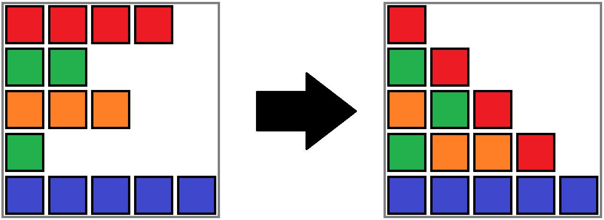
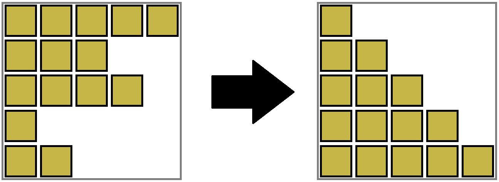

# E. Mycraft Sand Sort

**time limit per test:** 3 seconds

**memory limit per test:** 256 megabytes

**input:** standard input

**output:** standard output

Steve has a permutation$^{\text{∗}}$ $p$ and an array $c$, both of length $n$. Steve wishes to sort the permutation $p$.

Steve has an infinite supply of coloured sand blocks, and using them he discovered a physics-based way to sort an array of numbers called gravity sort. Namely, to perform gravity sort on $p$, Steve will do the following:

- For all $i$ such that $1 \le i \le n$, place a sand block of color $c_i$ in position $(i, j)$ for all $j$ where $1 \le j \le p_i$. Here, position $(x, y)$ denotes a cell in the $x$-th row from the top and $y$-th column from the left.
- Apply downwards gravity to the array, so that all sand blocks fall as long as they can fall.




 An example of gravity sort for the third testcase. $p = [4, 2, 3, 1, 5]$, $c = [2, 1, 4, 1, 5]$
Alex looks at Steve's sand blocks after performing gravity sort and wonders how many pairs of arrays $(p',c')$ where $p'$ is a permutation would have resulted in the same layout of sand. Note that the original pair of arrays $(p, c)$ will always be counted.

Please calculate this for Alex. As this number could be large, output it modulo $998\,244\,353$.

$^{\text{∗}}$A permutation of length $n$ is an array consisting of $n$ distinct integers from $1$ to $n$ in arbitrary order. For example, $[2,3,1,5,4]$ is a permutation, but $[1,2,2]$ is not a permutation ($2$ appears twice in the array), and $[1,3,4]$ is also not a permutation ($n=3$ but there is a $4$ in the array).

#### Input

The first line contains an integer $t$ ($1 \le t \le 10^4$) — the number of test cases.

The first line of each testcase contains an integer $n$ ($1 \le n \le 2 \cdot 10^5$) — the lengths of the arrays.

The second line of each testcase contains $n$ distinct integers $p_1,p_2,\ldots,p_n$ ($1 \le p_i \le n$) — the elements of $p$.

The following line contains $n$ integers $c_1,c_2,\ldots,c_n$ ($1 \le c_i \le n$) — the elements of $c$.

The sum of $n$ across all testcases does not exceed $2 \cdot 10^5$.

#### Output

For each testcase, output the number of pairs of arrays $(p', c')$ Steve could have started with, modulo $998\,244\,353$.

#### Example

#### Input
```
4
1
1
1
5
5 3 4 1 2
1 1 1 1 1
5
4 2 3 1 5
2 1 4 1 5
40
29 15 20 35 37 31 27 1 32 36 38 25 22 8 16 7 3 28 11 12 23 4 14 9 39 13 10 30 6 2 24 17 19 5 34 18 33 26 40 21
3 1 2 2 1 2 3 1 1 1 1 2 1 3 1 1 3 1 1 1 2 2 1 3 3 3 2 3 2 2 2 2 1 3 2 1 1 2 2 2
```

#### Output
```
1
120
1
143654893
```

#### Note

The second test case is shown below.




 Gravity sort of the second testcase.
It can be shown that permutations of $p$ will yield the same result, and that $c$ must equal $[1,1,1,1,1]$ (since all sand must be the same color), so the answer is $5! = 120$.

The third test case is shown in the statement above. It can be proven that no other arrays $p$ and $c$ will produce the same final result, so the answer is $1$.
