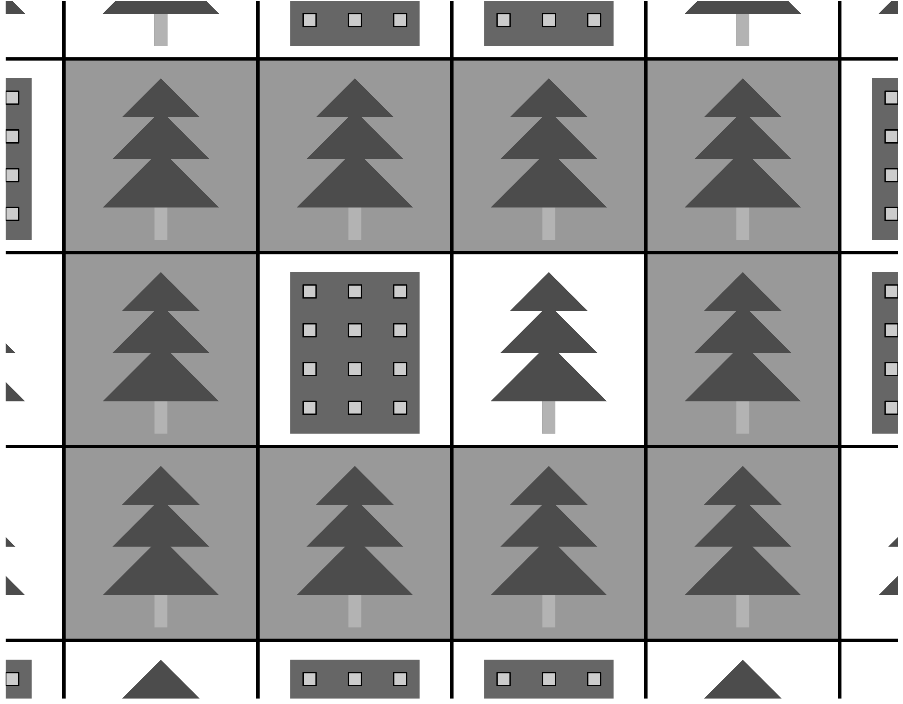
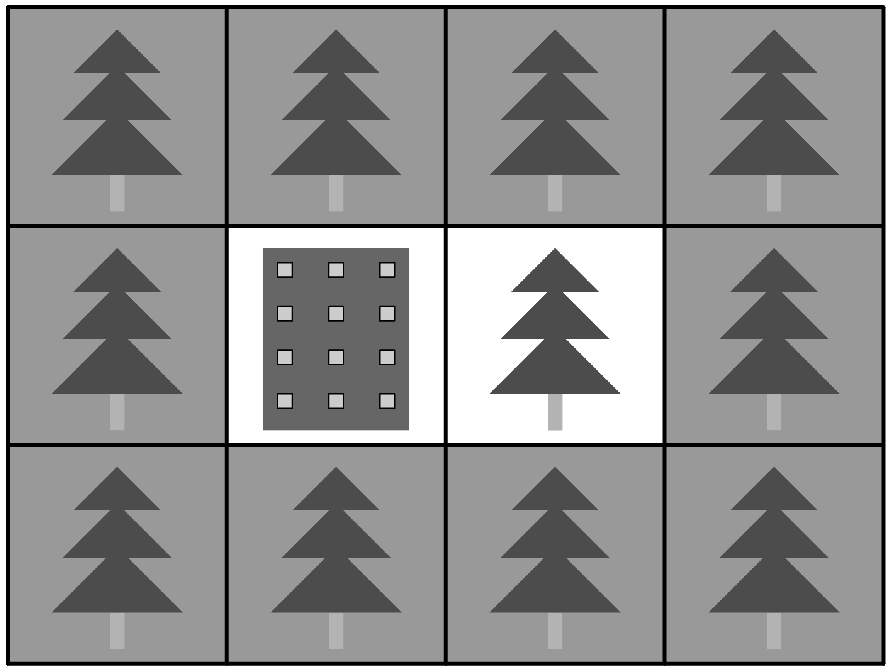
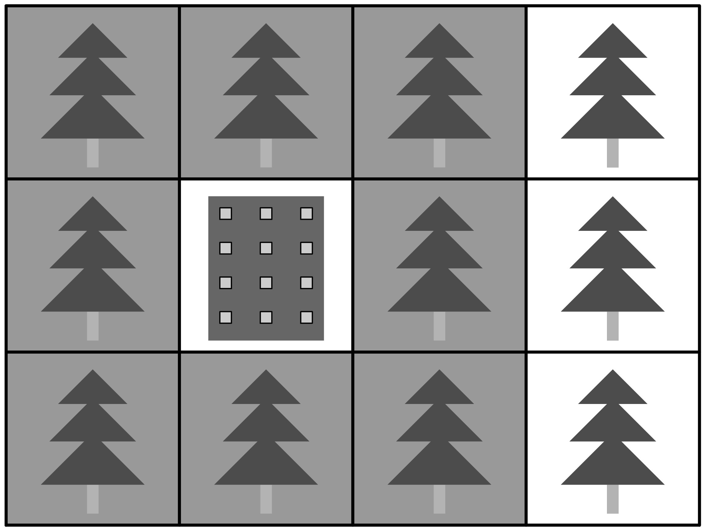
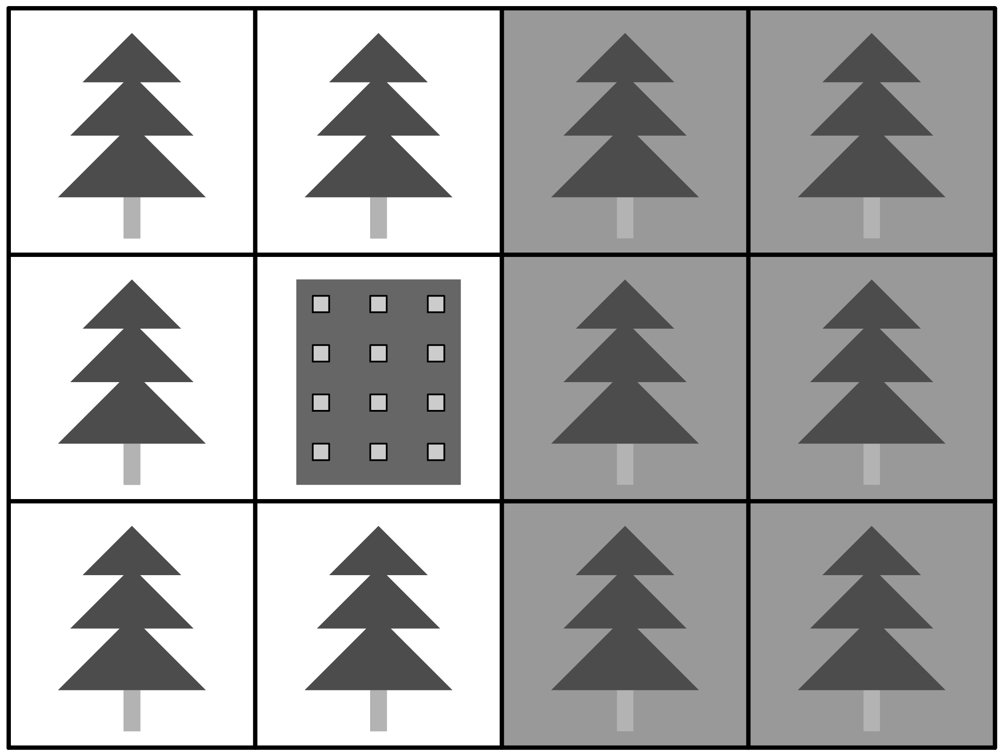
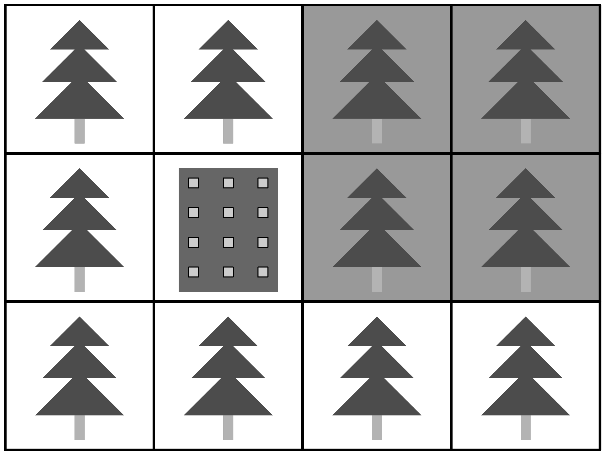
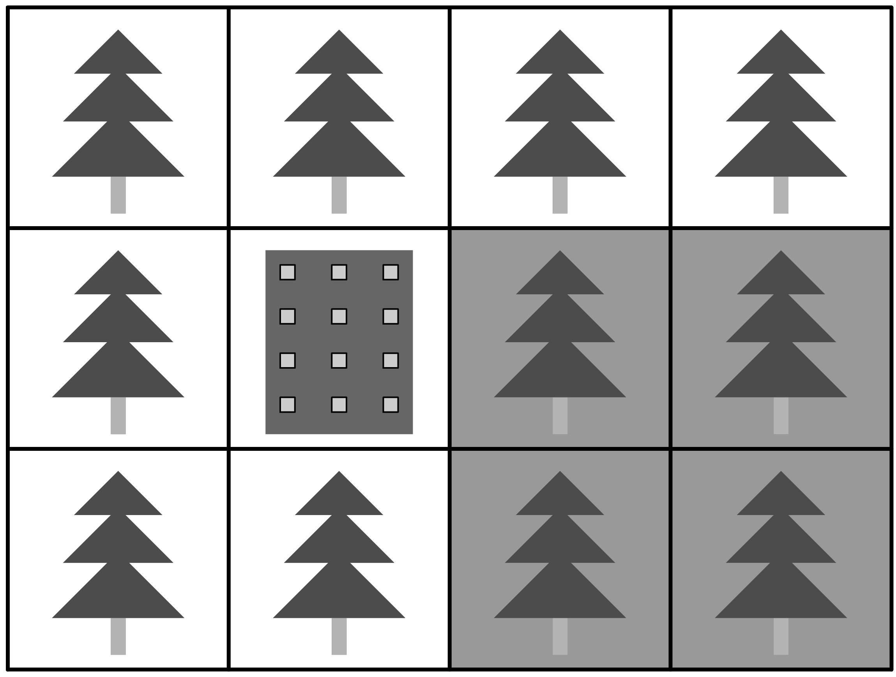

# B. Urban Planning

**time limit per test:** 2 seconds

**memory limit per test:** 1024 megabytes

**input:** standard input

**output:** standard output

You are responsible for planning a new city! The city will be represented by a rectangular grid, where each cell is either a park or a built-up area.

The residents will naturally want to go for walks in the city parks. In particular, a rectangular walk is a rectangle consisting of the grid cells, which is at least 2 cells long both horizontally and vertically, such that all cells on the boundary of the rectangle are parks. Note that the cells inside the rectangle can be arbitrary.




 An example rectangular walk (cells with dark background).
Your favourite number is $k$. To leave a long-lasting signature, you want to design the city in such a way that it has exactly $k$ rectangular walks.

#### Input

The input contains a single integer $k$ ($0 \le k \le 4.194\cdot 10^{12}$).

#### Output

On the first line, print two integers $h$ and $w$ ($1 \le h, w \le 2025$), the height and width of the grid. On the next $h$ lines, print a string with $w$ characters each, with each character being #, denoting a park, or ., denoting a built-up area.

It is guaranteed that for any value of $k$ within the given limits, there exists a solution with height and width within the given limits. Any city within the given limits and with exactly $k$ rectangular walks will be accepted.

#### Example

#### Input
```
5
```

#### Output
```
3 4
####
#.##
####
```

#### Note

In the sample, here are the five possible rectangular walks:










