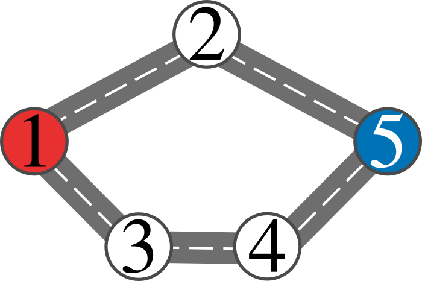
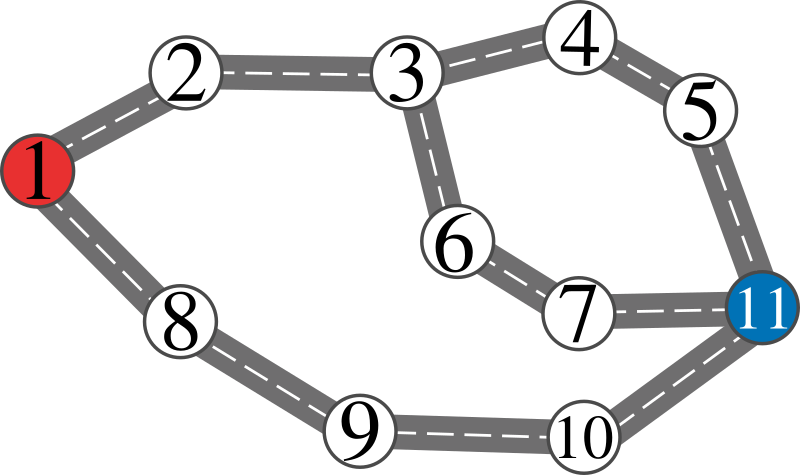
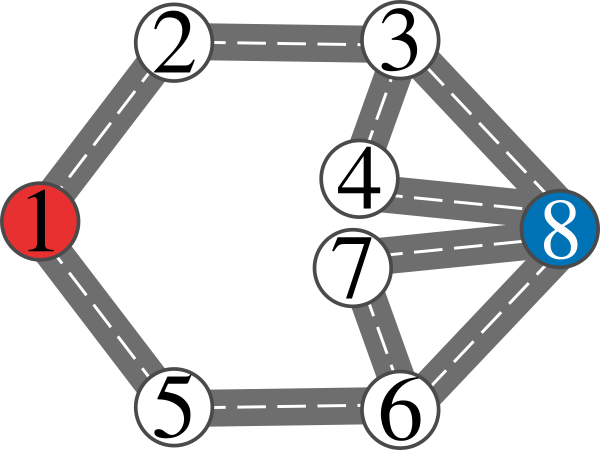

# E. Porto Vs. Benfica

**time limit per test:** 2 seconds

**memory limit per test:** 1024 megabytes

**input:** standard input

**output:** standard output

FC Porto and SL Benfica are the two largest football teams in Portugal. Naturally, when the two play each other, a lot of people travel from all over the country to watch the game. This includes the Benfica supporters' club, which is going to travel from Lisbon to Porto to watch the upcoming game. To avoid tensions between them and the Porto supporters' club, the national police want to delay their arrival to Porto as much as they can.

The road network in Portugal can be modelled as a simple, undirected, unweighted, connected graph with $n$ vertices and $m$ edges, where vertices represent towns and edges represent roads. Vertex $1$ corresponds to Lisbon, i.e., the starting vertex of the supporters' club, and vertex $n$ is Porto, i.e., the destination vertex of the supporters' club. The supporters' club wants to minimize the number of roads they take to reach Porto.

The police are following the supporters' club carefully, and so they always know where they are. To delay their arrival, at any point the police can pick exactly one road and block it, as long as the supporters' club isn't currently traversing it. They can do this exactly once, and once they do that, the road is blocked forever. Once the police block a road, the supporters' club immediately learns that that road is blocked, and they can change their route however they prefer. Furthermore, the supporters' club knows that the police are planning on blocking some road and can plan their route accordingly.

Assuming that both the supporters' club and the police always make optimal choices, determine the minimum number of roads the supporters' club needs to traverse to go from Lisbon to Porto. If the police can block the supporters' club from ever reaching Porto, then output $-1$.

#### Input

The first line contains two integers $n$ and $m$ ($2 \leq n \leq 200\,000$, $n - 1 \leq m \leq \min\{n(n - 1)/2, 200\,000\}$) — the number of towns and the number of roads in the road network of Portugal.

Each of the next $m$ lines contains two integers $s_i$ and $t_i$ ($1 \leq s_i, t_i \leq n$) — the two towns connected by the $i$-th road.

It is guaranteed that the road network is connected, each road connects two distinct towns, and that there are no repeated roads.

#### Output

Print the minimum number of roads the supporters' club needs to traverse to travel from Lisbon to Porto.

#### Examples

#### Input
```
5 5
1 2
1 3
2 5
3 4
4 5
```

#### Output
```
5
```

#### Input
```
11 12
1 2
2 3
3 4
4 5
5 11
3 6
6 7
7 11
1 8
8 9
9 10
10 11
```

#### Output
```
9
```

#### Input
```
8 10
1 2
2 3
3 4
3 8
4 8
1 5
5 6
6 7
6 8
7 8
```

#### Output
```
5
```

#### Note

In the first sample, the road network is represented by the following picture:





Note that the optimal strategy for the police is to wait until the supporters' club is on a vertex adjacent to the destination (i.e., vertex $5$) and then block the edge that connects that vertex to the destination. The optimal strategy for the supporters' club is to follow the upper path (by going from $1$ to $2$) and then after seeing the edge between $2$ and $5$ get blocked, they will go around by following $2$ back to $1$ and then following the lower path ($1$ to $3$ to $4$ to $5$). The number of traversed roads in this case is $5$.

In the second sample, the road network is represented by the following picture:





There are multiple strategies here, but one can verify that the optimal one for both the police and supporters' club is to follow the upper path ($1 \rightarrow 2 \rightarrow 3 \rightarrow 4 \rightarrow 5$), then the police block the edge $5$ to $11$, and so the supporters' club go around by following $5 \rightarrow 4 \rightarrow 3 \rightarrow 6 \rightarrow 7 \rightarrow 11$. The total number of traversed roads of this strategy is $9$.

In the third sample, the road network is represented by the following picture:





The optimal strategy for the police is to block edge $2$ to $3$ if the supporters' club reaches vertex $2$, or block edge $5$ to $6$ if the supporters' club reaches vertex $5$. The optimal path in this case is $1 \rightarrow 2 \rightarrow 1 \rightarrow 5 \rightarrow 6 \rightarrow 8$. The total number of traversed roads in this case is $5$.
