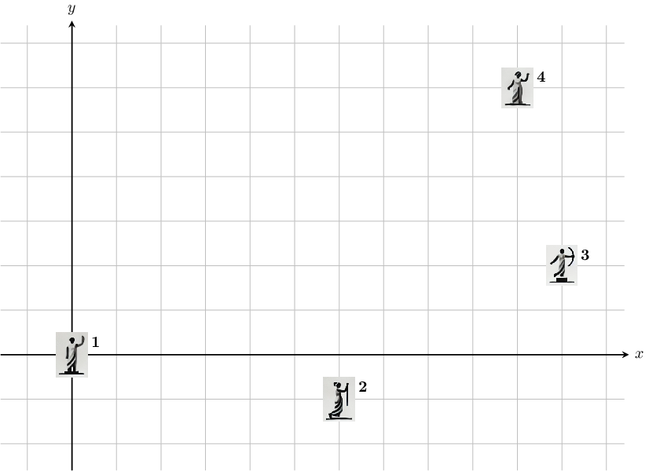

# H. Statues

**time limit per test:** 2 seconds

**memory limit per test:** 1024 megabytes

**input:** standard input

**output:** standard output

The mayor of a city wants to place $n$ statues at intersections around the city. The intersections in the city are at all points $(x, y)$ with integer coordinates. Distances between intersections are measured using Manhattan distance, defined as follows: $$ \text{distance}((x_1, y_1), (x_2, y_2)) = |x_1 - x_2| + |y_1 - y_2|. $$

The city council has provided the following requirements for the placement of the statues:

- The first statue is placed at $(0, 0)$;
- The $n$-th statue is placed at $(a, b)$;
- For $i = 1, \dots, n-1$, the distance between the $i$-th statue and the $(i+1)$-th statue is $d_i$.

It is allowed to place multiple statues at the same intersection.

Help the mayor find a valid arrangement of the $n$ statues, or determine that it does not exist.

#### Input

The first line contains an integer $n$ ($3 \le n \le 50$) — the number of statues.

The second line contains two integers $a$ and $b$ ($0 \le a, b \le 10^9$) — the coordinates of the intersection where the $n$-th statue must be placed.

The third line contains $n-1$ integers $d_1, \dots, d_{n-1}$ ($0 \le d_i \le 10^9$) — the distance between the $i$-th statue and the $(i+1)$-th statue.

#### Output

Print $\texttt{YES}$ if there is a valid arrangement of the $n$ statues. Otherwise, print $\texttt{NO}$.

If there is a valid arrangement, print a valid arrangement in the following $n$ lines. The $i$-th of these lines must contain two integers $x_i$ and $y_i$ — the coordinates of the intersection where the $i$-th statue is placed. You can print any valid arrangement if multiple exist.

#### Examples

#### Input
```
3
5 8
9 0
```

#### Output
```
NO
```

#### Input
```
4
10 6
7 8 5
```

#### Output
```
YES
0 0
6 -1
11 2
10 6
```

#### Note

In the first sample, there is no valid arrangement of the 3 statues.

In the second sample, the sample output is shown in the following picture. Note that this is not the only valid arrangement of the 4 statues.



