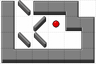
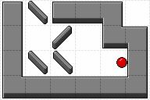
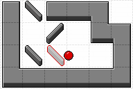
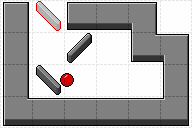
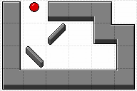

# I. Pinball

**time limit per test:** 5 seconds

**memory limit per test:** 1024 megabytes

**input:** standard input

**output:** standard output





You are playing a pinball-like game on a $h \times w$ grid.

The game begins with a small ball located at the center of a specific cell marked as $\texttt{S}$. Each cell of the grid is either:

- A block-type wall ($\texttt{#}$) that prevents the ball from entering the cell, reflecting it instead.
- A thin oblique wall, either left-leaning ($\texttt{\\}$) or right-leaning ($\texttt{/}$), which reflects the ball according to its orientation.
- A free cell ($\texttt{.}$) where the ball can move freely.

The goal is to make the ball escape the grid.

At the start, you can nudge the ball in one of four directions: up ($\texttt{U}$), down ($\texttt{D}$), left ($\texttt{L}$), or right ($\texttt{R}$). The ball traverses a free cell in one second, it enters and exits a cell containing a thin oblique wall in one second, and it bounces off a block-type wall in no time (the block-type wall occupies all of its cell).

Collisions between the ball and all walls, both block-type and oblique, are perfectly elastic, causing the ball to reflect upon contact.

For example, the ball takes two seconds to enter a free cell, traverse it, bounce off an adjacent block-type wall, and traverse back the free cell until it exits.

As the ball moves, you may destroy oblique walls at any time, permanently converting them into free cells. You may destroy multiple oblique walls throughout the game, at any given time.

Determine whether it is possible for the ball to escape, and if so, find the minimum number of oblique walls that need to be destroyed, along with the precise time each chosen wall should be destroyed.

#### Input

The first line contains two integers $h$ and $w$ ($1\le h, w \le 1000$) — the size of the grid.

The next $h$ lines describe the grid at the beginning of the game.

The $i$-th of these lines contains $w$ characters, describing the cells on the $i$-th row. A dot ($\texttt{.}$) denotes a free cell, a hash sign ($\texttt{#}$) denotes a block-type wall, a ($\texttt{\\}$) or ($\texttt{/}$) denotes a thin oblique wall, and an $\texttt{S}$ denotes the starting position of the ball (the starting position is a free cell).

It is guaranteed that all the $h\cdot w$ characters describing the grid belong to the set $\{\texttt{.},\, \texttt{#},\, \texttt{\\},\, \texttt{/},\, \texttt{S}\}$ and the character $\texttt{S}$ appears exactly once.

#### Output

Print $\texttt{YES}$ if it is possible to make the ball escape the grid. Otherwise, print $\texttt{NO}$.

If it is possible, print the following extra information.

On the second line, print a single character $d \in \{ \texttt{U}, \texttt{D}, \texttt{L}, \texttt{R} \}$ — the direction of the starting nudge of the ball.

On the third line, print $k$ — the minimum number of oblique walls to be destroyed.

On each of the following $k$ lines, print three integers $t_i$, $r_i$, and $c_i$ — the oblique wall in the cell on the $r_i$-th row from the top and on the $c_i$-th column from the left is destroyed $t_i$ seconds after the ball starts moving. Note that the corresponding wall is destroyed just before $t_i$ seconds have elapsed, essentially meaning that the corresponding cell acts as a free cell if the ball would have hit that wall exactly $t_i$ seconds after the start.

The operations must be printed in chronological order (i.e., $t_i\le t_{i+1}$ for all $1\le i\le k-1$). The same wall cannot be destroyed multiple times (i.e., $(r_i,c_i)\not=(r_j,c_j)$ if $i\not=j$). Initially, there must be an oblique wall at the cell identified by $(r_i, c_i)$ for all $1\le i\le k$.

All $t_i$ must satisfy $0 \leq t_i \leq 10^7$. It can be proved that, if there exists a solution, there exists a solution where no $t_i$ exceeds $10^7$.

#### Examples

#### Input
```
4 6
#\###.
#./S##
#\\..#
######
```

#### Output
```
YES
L
2
7 3 3
8 1 2
```

#### Input
```
3 3
###
.S.
###
```

#### Output
```
YES
R
0
```

#### Note

In the first sample, the minimum number of walls to be destroyed is 2. We describe the relevant moments of the solution given as sample output.











- At time $t=0$, the ball is in its initial position and gets nudged towards the left direction.
- At time $t=4.5$, the ball hits a block-type wall and reflects off of it.
- Right before $t=7$, the wall at position $(3, 3)$ is destroyed.
- Right before $t=8$, the wall at position $(1, 2)$ is destroyed.
- At time $t = 10.5$, the ball finally escapes the grid.

In the second sample, you can just nudge the ball towards the left or right direction, and the ball will eventually escape the grid.
