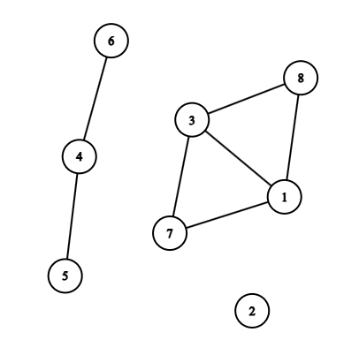

# F. Graph Inclusion

**time limit per test:** 5 seconds

**memory limit per test:** 512 megabytes

**input:** standard input

**output:** standard output

A connected component of an undirected graph is defined as a set of vertices $S$ of this graph such that:

- for every pair of vertices $(u, v)$ in $S$, there exists a path between vertices $u$ and $v$;
- there is no vertex outside $S$ that has a path to a vertex within $S$.

For example, the graph in the picture below has three components: $\{1, 3, 7, 8\}$, $\{2\}$, $\{4, 5, 6\}$.





We say that graph $A$ includes graph $B$ if every component of graph $B$ is a subset of some component of graph $A$.

You are given two graphs, $A$ and $B$, both consisting of $n$ vertices numbered from $1$ to $n$. Initially, there are no edges in the graphs. You must process queries of two types:

- add an edge to one of the graphs;
- remove an edge from one of the graphs.

After each query, you have to calculate the minimum number of edges that have to be added to $A$ so that $A$ includes $B$, and print it. Note that you don't actually add these edges, you just calculate their number.

#### Input

The first line contains two integers $n$ and $q$ ($2 \le n \le 4 \cdot 10^5$; $1 \le q \le 4 \cdot 10^5$) — the number of vertices and queries, respectively.

Next, there are $q$ lines, where the $i$-th line describes the $i$-th query. The description of the query begins with the character $c_i$ (either A or B) — the graph to which the query should be applied. Then, two integers $x_i$ and $y_i$ follow ($1 \le x_i, y_i \le n$; $x_i \ne y_i$). If there is an edge $(x_i, y_i)$ in the corresponding graph, it should be removed; otherwise, it should be added to that graph.

#### Output

For each query, print one integer — the minimum number of edges that you have to add to the graph $A$ so that it includes $B$.

#### Example

#### Input
```
6 9
A 2 3
B 1 3
A 2 1
A 3 2
B 5 6
A 6 5
A 3 4
A 4 2
A 4 3
```

#### Output
```
0
1
0
1
2
1
1
0
1
```
