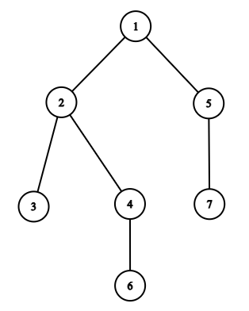

# D. Tree Jumps

**time limit per test:** 2 seconds

**memory limit per test:** 512 megabytes

**input:** standard input

**output:** standard output

You are given a rooted tree, consisting of $n$ vertices. The vertices in the tree are numbered from $1$ to $n$, and the root is the vertex $1$. Let $d_x$ be the distance (the number of edges on the shortest path) from the root to the vertex $x$.

There is a chip that is initially placed at the root. You can perform the following operation as many times as you want (possibly zero):

- move the chip from the current vertex $v$ to a vertex $u$ such that $d_u = d_v + 1$. If $v$ is the root, you can choose any vertex $u$ meeting this constraint; however, if $v$ is not the root, $u$ should not be a neighbor of $v$ (there should be no edge connecting $v$ and $u$).





For example, in the tree above, the following chip moves are possible: $1 \rightarrow 2$, $1 \rightarrow 5$, $2 \rightarrow 7$, $5 \rightarrow 3$, $5 \rightarrow 4$, $3 \rightarrow 6$, $7 \rightarrow 6$.

A sequence of vertices is valid if you can move the chip in such a way that it visits all vertices from the sequence (and only them), in the order they are given in the sequence.

Your task is to calculate the number of valid vertex sequences. Since the answer might be large, print it modulo $998244353$.

#### Input

The first line contains a single integer $t$ ($1 \le t \le 10^4$) — the number of test cases.

The first line of each test case contains a single integer $n$ ($2 \le n \le 3 \cdot 10^5$).

The second line contains $n-1$ integers $p_2, p_3, \dots, p_n$ ($1 \le p_i \lt i$), where $p_i$ is the parent of the $i$-th vertex in the tree. Vertex $1$ is the root.

Additional constraint on the input: the sum of $n$ over all test cases doesn't exceed $3 \cdot 10^5$.

#### Output

For each test case, print a single integer — the number of valid vertex sequences, taken modulo $998244353$.

#### Example

#### Input
```
3
4
1 2 1
3
1 2
7
1 2 2 1 4 5
```

#### Output
```
4
2
8
```

#### Note

In the first example, the following sequences are valid: $[1]$, $[1, 2]$, $[1, 4]$, $[1, 4, 3]$.

In the second example, the following sequences are valid: $[1]$, $[1, 2]$.

In the third example, the following sequences are valid: $[1]$, $[1, 2]$, $[1, 2, 7]$, $[1, 2, 7, 6]$, $[1, 5]$, $[1, 5, 3]$, $[1, 5, 3, 6]$, $[1, 5, 4]$.
