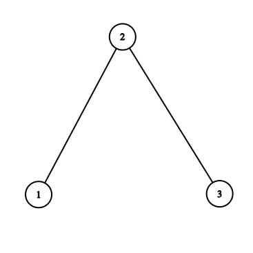
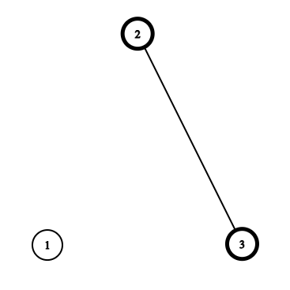
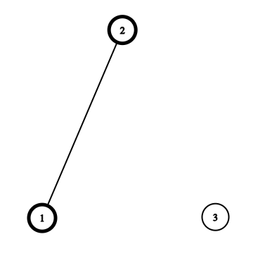
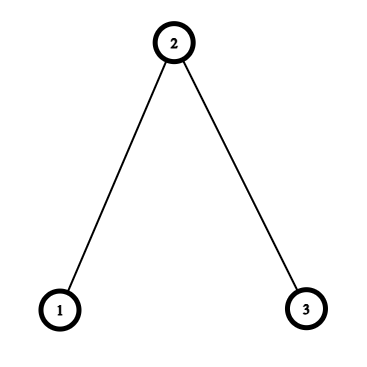

# E. LeaFall

**time limit per test:** 3 seconds

**memory limit per test:** 512 megabytes

**input:** standard input

**output:** standard output


You are given a tree$^{\text{∗}}$ with $n$ vertices. Over time, each vertex $i$ ($1 \le i \le n$) has a probability of $\frac{p_i}{q_i}$ of falling. Determine the expected value of the number of unordered pairs$^{\text{†}}$ of distinct vertices that become leaves$^{\text{‡}}$ in the resulting forest$^{\text{§}}$, modulo $998\,244\,353$.

Note that when vertex $v$ falls, it is removed along with all edges connected to it. However, adjacent vertices remain unaffected by the fall of $v$.

$^{\text{∗}}$A tree is a connected graph without cycles.

$^{\text{†}}$An unordered pair is a collection of two elements where the order in which the elements appear does not matter. For example, the unordered pair $(1, 2)$ is considered the same as $(2, 1)$.

$^{\text{‡}}$A leaf is a vertex that is connected to exactly one edge.

$^{\text{§}}$A forest is a graph without cycles

#### Input

Each test contains multiple test cases. The first line contains the number of test cases $t$ ($1 \le t \le 10^4$). The description of the test cases follows.

The first line of each test case contains a single integer $n$ ($1 \le n \le 10^5$).

The $i$-th line of the following $n$ lines contains two integers $p_i$ and $q_i$ ($1 \le p_i \lt q_i \lt 998\,244\,353$).

Each of the following $n - 1$ lines contains two integers $u$ and $v$ ($1 \le u, v \le n$, $u \neq v$) — the indices of the vertices connected by an edge.

It is guaranteed that the given edges form a tree.

It is guaranteed that the sum of $n$ over all test cases does not exceed $10^5$.

#### Output

For each test case, output a single integer — the expected value of the number of unordered pairs of distinct vertices that become leaves in the resulting forest modulo $998\,244\,353$.

Formally, let $M = 998\,244\,353$. It can be shown that the exact answer can be expressed as an irreducible fraction $\frac{p}{q}$, where $p$ and $q$ are integers and $q \not \equiv 0 \pmod{M}$. Output the integer equal to $p \cdot q^{-1} \bmod M$. In other words, output such an integer $x$ that $0 \le x \lt M$ and $x \cdot q \equiv p \pmod{M}$.

#### Examples

#### Input
```
5
1
1 2
3
1 2
1 2
1 2
1 2
2 3
3
1 3
1 5
1 3
1 2
2 3
1
998244351 998244352
6
10 17
7 13
6 11
2 10
10 19
5 13
4 3
3 6
1 4
3 5
3 2
```

#### Output
```
0
623902721
244015287
0
799215919
```

#### Input
```
1
10
282508078 551568452
894311255 989959022
893400641 913415297
460925436 801908985
94460427 171411253
997964895 998217862
770266391 885105593
591419316 976424827
606447024 863339056
940224886 994244553
9 5
9 6
9 8
8 7
3 6
1 5
7 4
8 10
4 2
```

#### Output
```
486341067
```

#### Note

In the first test case, only one vertex is in the tree, which is not a leaf, so the answer is $0$.

In the second test case, the tree is shown below.





Vertices that have not fallen are denoted in bold. Let us examine the following three cases:




 We arrive at this configuration with a probability of $\left( \frac{1}{2} \right) ^3$, where the only unordered pair of distinct leaf vertices is $(2, 3)$.



 We arrive at this configuration with a probability of $\left( \frac{1}{2} \right) ^3$, where the only unordered pair of distinct leaf vertices is $(2, 1)$.



 We arrive at this configuration with a probability of $\left( \frac{1}{2} \right) ^3$, where the only unordered pair of distinct leaf vertices is $(1, 3)$.
All remaining cases contain no unordered pairs of distinct leaf vertices. Hence, the answer is $\frac{1 + 1 + 1}{8} = \frac{3}{8}$, which is equal to $623\,902\,721$ modulo $998\,244\,353$.
