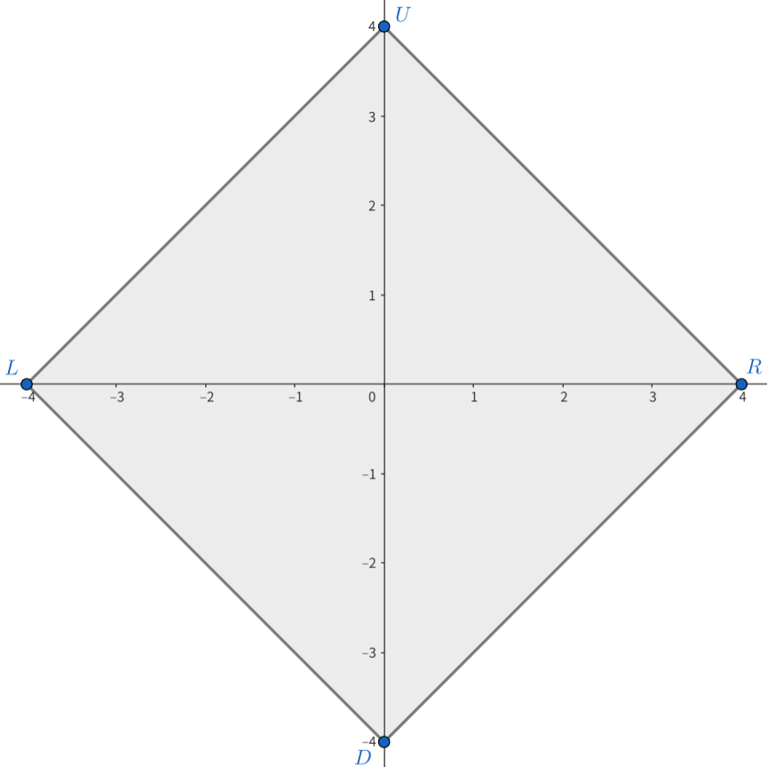

# A. Draw a Square

**time limit per test:** 1 second

**memory limit per test:** 256 megabytes

**input:** standard input

**output:** standard output

The pink soldiers have given you $4$ distinct points on the plane. The $4$ points' coordinates are $(-l,0)$, $(r,0)$, $(0,-d)$, $(0,u)$ correspondingly, where $l$, $r$, $d$, $u$ are positive integers.




 In the diagram, a square is drawn by connecting the four points $L$, $R$, $D$, $U$.
Please determine if it is possible to draw a square$^{\text{∗}}$ with the given points as its vertices.

$^{\text{∗}}$A square is defined as a polygon consisting of $4$ vertices, of which all sides have equal length and all inner angles are equal. No two edges of the polygon may intersect each other.

#### Input

Each test contains multiple test cases. The first line contains the number of test cases $t$ ($1 \le t \le 10^4$). The description of the test cases follows.

The first line of each test case contains four integers $l$, $r$, $d$, $u$ ($1 \le l,r,d,u \le 10$).

#### Output

For each test case, if you can draw a square using the four points, output "Yes". Otherwise, output "No".

You can output the answer in any case. For example, the strings "yEs", "yes", and "YES" will also be recognized as positive responses.

#### Example

#### Input
```
2
2 2 2 2
1 2 3 4
```

#### Output
```
Yes
No
```

#### Note

On the first test case, the four given points form a square, so the answer is "Yes".

On the second test case, the four given points do not form a square, so the answer is "No".
