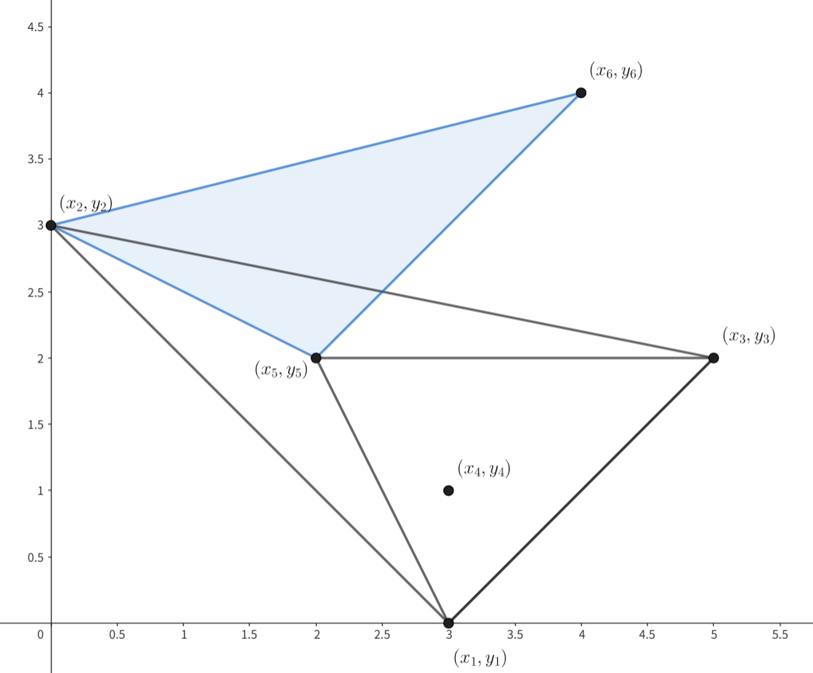

# E. Empty Triangle

**time limit per test:** 2 seconds

**memory limit per test:** 512 megabytes

**input:** standard input

**output:** standard output


This is an interactive problem.

The pink soldiers hid from you $n$ ($3 \le n \le 1500$) fixed points $(x_1,y_1), (x_2,y_2), \ldots, (x_n,y_n)$, whose coordinates are not given to you. Also, it is known that no two points have the same coordinates, and no three points are [collinear](<https://en.wikipedia.org/wiki/Collinearity>).

You can ask the Frontman about three distinct indices $i$, $j$, $k$. Then, he will draw a triangle with points $(x_i,y_i)$, $(x_j,y_j)$, $(x_k,y_k)$, and respond with the following:

- If at least one of the hidden points lies inside the triangle, then the Frontman gives you the index of one such point. Do note that if there are multiple such points, the Frontman can arbitrarily select one of them.
- Otherwise, the Frontman responds with $0$.


 Your objective in this problem is to find a triangle not containing any other hidden point, such as the blue one in the diagram.
Using at most $\mathbf{75}$ queries, you must find any triangle formed by three of the points, not containing any other hidden point inside.

Do note that the Frontman may be adaptive while choosing the point to give you. In other words, the choice of the point can be determined by various factors including but not limited to the orientation of points and the previous queries. However, note that the sequence of points will never be altered.

Hacks are disabled for this problem. Your solution will be judged on exactly $\mathbf{35}$ input files, including the example input.

#### Interaction

Each test contains multiple test cases. The first line contains the number of test cases $t$ ($1 \le t \le 20$). The description of the test cases follows.

The first line of each test case contains one positive integer $n$ — the number of points ($3 \le n \le 1500$).

Afterwards, you can output the following on a separate line to ask a query:

- "? i j k" ($1 \le i,j,k \le n$, $i \ne j$, $i \ne k$, $j \ne k$): Ask about the triangle formed by $(x_i,y_i)$, $(x_j,y_j)$, $(x_k,y_k)$.

Then, the interactor responds with one integer on a new line:

- If your query is invalid or the number of queries has exceeded $\mathbf{75}$, then the interactor responds with $-1$;
- If there exists an index $p$ ($1 \le p \le n$) such that the point $(x_p,y_p)$ is inside the triangle, then any such index $p$ is given;
- Otherwise, the interactor responds with $0$.

If you want to print an answer, you can output the following on a separate line:

- "! i j k" ($1 \le i,j,k \le n$, $i \ne j$, $i \ne k$, $j \ne k$): The triangle formed by $(x_i,y_i)$, $(x_j,y_j)$, $(x_k,y_k)$ contains no other hidden point.

Then, the following interaction happens:

- If the answer is invalid or the triangle contains another hidden point, the interactor responds with $-1$;
- If the answer is correct and there are more test cases to solve, you are given the value of $n$ for the next test case;
- Otherwise, it means that all test cases are solved correctly, and your program may terminate gracefully.

Do note that printing the answer does not count towards the number of queries made.

Do note that the interactor may be adaptive while choosing the point to give you. In other words, the choice of the point can be determined by various factors including but not limited to the orientation of points and the previous queries. However, note that the sequence of points will never be altered.

After printing each query do not forget to output the end of line and flush$^{\text{∗}}$ the output. Otherwise, you will get Idleness limit exceeded verdict.

If, at any interaction step, you read $-1$ instead of valid data, your solution must exit immediately. This means that your solution will receive Wrong answer because of an invalid query or any other mistake. Failing to exit can result in an arbitrary verdict because your solution will continue to read from a closed stream.

Hacks

Hacks are disabled for this problem. Your solution will be judged on exactly $\mathbf{35}$ input files, including the example input.

$^{\text{∗}}$To flush, use:

- fflush(stdout) or cout.flush() in C++;
- sys.stdout.flush() in Python;
- see the documentation for other languages.

#### Example

#### Input
```
2
6

5

4

0

3
```

#### Output
```
? 1 2 3

? 1 5 3

? 2 5 6

! 2 5 6

! 1 2 3
```

#### Note

In the first test case, the points are $(3,0),(0,3),(5,2),(3,1),(2,2),(4,4)$.

The triangles corresponding to the three queries are as follows.





You can see that the triangle formed by $(0,3)$, $(2,2)$, $(4,4)$ does not contain any other hidden point inside. Therefore, it is a valid answer.

Do note that the interaction example only shows a valid interaction, and not necessarily the actual response. For example, it is possible that the Frontman responds with $4$ when you query "? 1 2 3". However, as the Frontman does not alter the sequence of points, he never responds with $6$ for the same query.

In the second test case, there are only $3$ points. Therefore, we know that the unique triangle formed by the points does not contain any other hidden point inside.
