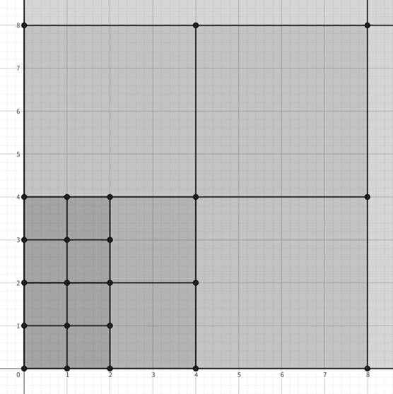

# F. Counting Necessary Nodes

**time limit per test:** 2 seconds

**memory limit per test:** 512 megabytes

**input:** standard input

**output:** standard output

A quadtree is a tree data structure in which each node has at most four children and accounts for a square-shaped region.

Formally, for all tuples of nonnegative integers $k,a,b \ge 0$, there exists exactly one node accounting for the following region$^{\text{∗}}$.

$$[a \cdot 2^k,(a+1) \cdot 2^k] \times [b \cdot 2^k,(b+1) \cdot 2^k]$$

All nodes whose region is larger than $1 \times 1$ contain four children corresponding to the regions divided equally into four, and the nodes whose region is $1 \times 1$ correspond to the leaf nodes of the tree.




 A small subset of the regions accounted for by the nodes is shown. The relatively darker regions are closer to leaf nodes.
The Frontman hates the widespread misconception, such that the quadtree can perform range queries in $\mathcal{O}(\log n)$ time when there are $n$ leaf nodes inside the region. In fact, sometimes it is necessary to query much more than $\mathcal{O}(\log n)$ regions for this, and the time complexity is $\mathcal{O}(n)$ in some extreme cases. Thus, the Frontman came up with this task to educate you about this worst case of the data structure.

The pink soldiers have given you a finite region $[l_1,r_1] \times [l_2,r_2]$, where $l_i$ and $r_i$ ($l_i \lt r_i$) are nonnegative integers. Please find the minimum number of nodes that you must choose in order to make the union of regions accounted for by the chosen nodes exactly the same as the given region. Here, two sets of points are considered different if there exists a point included in one but not in the other.

$^{\text{∗}}$Regions are sets of points with real coordinates, where the point $(x,y)$ is included in the region $[p,q] \times [r,s]$ if and only if $p \le x \le q$ and $r \le y \le s$. Here, $\times$ formally refers to [Cartesian product of sets](<https://en.wikipedia.org/wiki/Cartesian_product>).

#### Input

Each test contains multiple test cases. The first line contains the number of test cases $t$ ($1 \le t \le 10^4$). The description of the test cases follows.

The only line of each test case contains four integers $l_1$, $r_1$, $l_2$, $r_2$ — the boundaries of the region in each axis ($0 \le l_i \lt r_i \le 10^6$).

#### Output

For each test case, output the minimum number of nodes necessary to satisfy the condition on a separate line.

#### Example

#### Input
```
5
0 1 1 2
0 2 0 2
1 3 1 3
0 2 1 5
9 98 244 353
```

#### Output
```
1
1
4
5
374
```

#### Note

On the first test case, the given region is $[0,1] \times [1,2]$. There is one node accounting for $[0,1] \times [1,2]$. Choosing this node, the answer is $1$.

On the second test case, the given region is $[0,2] \times [0,2]$. There is one node accounting for $[0,2] \times [0,2]$. Choosing this node, the answer is $1$.

On the third test case, the given region is $[1,3] \times [1,3]$. There is no node that accounts for $[1,3] \times [1,3]$. Instead, you can make the union of regions exactly the same as $[1,3] \times [1,3]$ by choosing the following $4$ nodes:

- A leaf node accounting for $[1,2] \times [1,2]$;
- A leaf node accounting for $[1,2] \times [2,3]$;
- A leaf node accounting for $[2,3] \times [1,2]$;
- A leaf node accounting for $[2,3] \times [2,3]$.

It can be shown that it is impossible to make the union of regions exactly the same as $[1,3] \times [1,3]$ with less than $4$ nodes. Therefore, the answer is $4$.

On the fourth test case, the given region is $[0,2] \times [1,5]$. You can make the union of regions exactly the same as $[0,2] \times [1,5]$ by choosing the following $5$ nodes:

- A leaf node accounting for $[0,1] \times [1,2]$;
- A leaf node accounting for $[1,2] \times [1,2]$;
- A non-leaf node accounting for $[0,2] \times [2,4]$;
- A leaf node accounting for $[0,1] \times [4,5]$;
- A leaf node accounting for $[1,2] \times [4,5]$.

It can be shown that it is impossible to make the union of regions exactly the same as $[0,2] \times [1,5]$ with less than $5$ nodes. Therefore, the answer is $5$.
