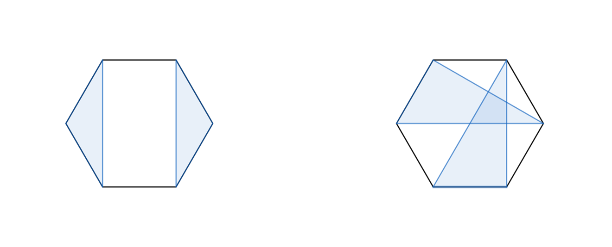
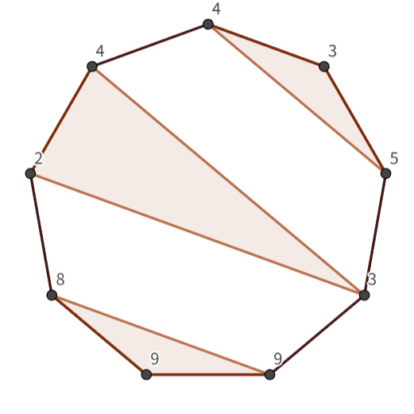

# G. Game With Triangles: Season 2

**time limit per test:** 4 seconds

**memory limit per test:** 512 megabytes

**input:** standard input

**output:** standard output

 The Frontman greets you to this final round of the survival game.
There is a regular polygon with $n$ sides ($n \ge 3$). The vertices are indexed as $1,2,\ldots,n$ in clockwise order. On each vertex $i$, the pink soldiers have written a positive integer $a_i$. With this regular polygon, you will play a game defined as follows.

Initially, your score is $0$. Then, you perform the following operation any number of times to increase your score.

- Select $3$ different vertices $i$, $j$, $k$ that you have not chosen before, and draw the triangle formed by the three vertices.

 - Then, your score increases by $a_i \cdot a_j \cdot a_k$.
 - However, you can not perform this operation if the triangle shares a positive common area with any of the triangles drawn previously.




 An example of a state after two operations is on the left. The state on the right is impossible as the two triangles share a positive common area.
Your objective is to maximize the score. Please find the maximum score you can get from this game.

#### Input

Each test contains multiple test cases. The first line contains the number of test cases $t$ ($1 \le t \le 10^4$). The description of the test cases follows.

The first line of each test case contains a single integer $n$ — the number of vertices ($3 \le n \le 400$).

The second line of each test case contains $a_1,a_2,\ldots,a_n$ — the integers written on vertices ($1 \le a_i \le 1000$).

It is guaranteed that the sum of $n^3$ over all test cases does not exceed $400^3$.

#### Output

For each test case, output the maximum score you can get on a separate line.

#### Example

#### Input
```
6
3
1 2 3
4
2 1 3 4
6
2 1 2 1 1 1
6
1 2 1 3 1 5
9
9 9 8 2 4 4 3 5 3
9
9 9 3 2 4 4 8 5 3
```

#### Output
```
6
24
5
30
732
696
```

#### Note

On the first test case, you can draw only one triangle. The maximum score $6$ is found by drawing the triangle with $i=1$, $j=2$, $k=3$.

On the second test case, you can draw only one triangle. The maximum score $24$ is found by drawing the triangle with $i=1$, $j=3$, $k=4$.

On the third test case, you can draw two triangles. There is a series of two operations that leads to the score $5$, which is the maximum.

On the fourth test case, you can draw two triangles. However, drawing two triangles leads to a score of either $6+5=11$, $15+2=17$, or $10+3=13$. The maximum score $30$ is found by drawing only one triangle with $i=2$, $j=4$, $k=6$.

On the fifth test case, you can draw three triangles. The maximum score $732$ is found by drawing three triangles as follows.



