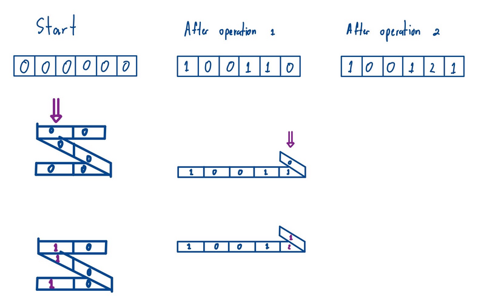

# E. Another Folding Strip

**time limit per test:** 2 seconds

**memory limit per test:** 256 megabytes

**input:** standard input

**output:** standard output

For an array $b$ of length $m$, define $f(b)$ as follows.

Consider a $1 \times m$ strip, where all cells initially have darkness $0$. You want to transform it into a strip where the color at the $i$-th position has darkness $b_i$. You can perform the following operation, which consists of two steps:
- Fold the paper at any line between two cells. You may fold as many times as you like, or choose not to fold at all.
- Choose one position to drop the black dye. The dye permeates from the top and flows down to the bottom, increasing the darkness of all cells in its path by $1$. After dropping the dye, you unfold the strip.

Let $f(b)$ be the minimum number of operations required to achieve the desired configuration. It can be proven that the goal can always be achieved in a finite number of operations.

You are given an array $a$ of length $n$. Evaluate

$$\sum_{l=1}^n\sum_{r=l}^n f(a_l a_{l+1} \ldots a_r)$$

modulo $998\,244\,353$.

#### Input

Each test contains multiple test cases. The first line contains the number of test cases $t$ ($1 \le t \le 10^4$). The description of the test cases follows.

The first line of each test case contains a single integer $n$ ($1 \leq n \leq 2 \cdot 10^5$) — the length of the array $a$.

The second line contains $n$ integers $a_1, a_2, \ldots, a_n$ ($0 \leq a_i \leq 10^9$) — denoting the array $a$.

It is guaranteed that the sum of all values of $n$ across all test cases does not exceed $2 \cdot 10^5$.

#### Output

For each test case, output a single integer — the required sum modulo $998\,244\,353$.

#### Example

#### Input
```
4
3
0 1 0
6
1 0 0 1 2 1
5
2 1 2 4 3
12
76 55 12 32 11 45 9 63 88 83 32 6
```

#### Output
```
4
28
47
7001
```

#### Note

In the first test case,

- $f(a_1)=f(\mathtt{0})=0$
- $f(a_1a_2)=f(\mathtt{01})=1$
- $f(a_1a_2a_3)=f(\mathtt{010})=1$
- $f(a_2)=f(\mathtt{1})=1$
- $f(a_2a_3)=f(\mathtt{10})=1$
- $f(a_3)=f(\mathtt{0})=0$

This sums up to $0+1+1+1+1+0 = 4$

In the second test case, $f(a_1a_2a_3a_4a_5a_6) = 2$. Here's one possible sequence of operations.



