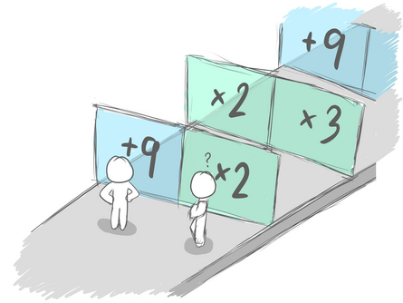

# D. Scammy Game Ad

**time limit per test:** 3 seconds

**memory limit per test:** 256 megabytes

**input:** standard input

**output:** standard output

Consider the following game.





In this game, a level consists of $n$ pairs of gates. Each pair contains one left gate and one right gate. Each gate performs one of two operations:

- Addition Operation (+ a): Increases the number of people in a lane by a constant amount $a$.
- Multiplication Operation (x a): Multiplies the current number of people in a lane by an integer $a$. This means the number of people increases by $(a - 1)$ times the current count in that lane.

The additional people gained from each operation can be assigned to either lane. However, people already in a lane cannot be moved to the other lane.

Initially, there is one person in each lane. Your task is to determine the maximum total number of people that can be achieved by the end of the level.

#### Input

The first line contains an integer $t$ ($1 \leq t \leq 10^4$) — the number of test cases.

The first line of each test case contains one integer $n$ ($1 \leq n \le 30$) — the number of pairs of gates.

The next $n$ lines of each test case provide the information for the left gate followed by the right gate of each gate pair. The information for each gate is given in the form + $a$ ($1 \le a \le 1000$) or x $a$ ($2 \le a \le 3$) for some integer $a$.

#### Output

For each test case, output a single integer — the maximum total number of people at the end of the level.

#### Example

#### Input
```
4
3
+ 4 x 2
x 3 x 3
+ 7 + 4
4
+ 9 x 2
x 2 x 3
+ 9 + 10
x 2 + 1
4
x 2 + 1
+ 9 + 10
x 2 x 3
+ 9 x 2
5
x 3 x 3
x 2 x 2
+ 21 + 2
x 2 x 3
+ 41 x 3
```

#### Output
```
32
98
144
351
```

#### Note

In the first case, here is one possible way to play this game optimally.

Initially, we have $l=1$ person in the left lane and $r=1$ person in the right lane.

After passing through the first pair of gates, we gain $4$ people from the left gate and $1 \cdot (2-1) = 1$ person from the right gate, for a total of $4+1=5$ people. We allocate $2$ people to the left lane and $3$ people to the right lane. This results in $l=1+2=3$ people in the left lane and $r=1+3=4$ people in the right lane.

After passing through the second pair of gates, we gain $3 \cdot (3-1) = 6$ people from the left gate and $4 \cdot (3-1) = 8$ people from the right gate, for a total of $6+8=14$ people. We allocate $7$ people to the left lane and $7$ people to the right lane. This results in $l=3+7=10$ people in the left lane and $r=4+7=11$ people in the right lane.

After passing through the last pair of gates, we gain $7$ people from the left gate and $4$ people from the right gate, for a total of $7+4=11$ people. We allocate $6$ people to the left lane and $5$ people to the right lane. This results in $l=10+6=16$ people in the left lane and $r=11+5=16$ people in the right lane.

At the end, the total number of people is $16+16=32$.
