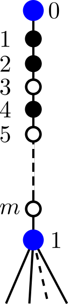
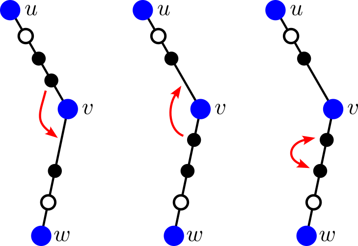

# E. Quantifier

**time limit per test:** 2.5 seconds

**memory limit per test:** 1024 megabytes

**input:** standard input

**output:** standard output

Given a rooted tree with $n+1$ nodes labeled from $0$ to $n$, where the root is node $0$, and its only child is node $1$. There are $m$ distinct chips labeled from $1$ to $m$, each colored either black or white. Initially, they are arranged on edge $(0,1)$ from top to bottom in ascending order of labels.




 The initial position of the chips. Tree nodes are shown in blue.
You can perform the following operations any number of times (possibly zero) in any order:

- Select two edges ($u,v$) and ($v,w$) such that $u$ is the parent of $v$ and $v$ is the parent of $w$, where edge ($u,v$) contains at least one chip. Move the bottommost chip on edge ($u,v$) to the topmost place on edge ($v,w$), i. e., above all existing chips on ($v,w$).
- Select two edges ($u,v$) and ($v,w$) such that $u$ is the parent of $v$ and $v$ is the parent of $w$, where edge ($v,w$) contains at least one chip. Move the topmost chip on edge ($v,w$) to the bottommost place on edge ($u,v$), i. e., below all existing chips on ($u,v$).
- Select two adjacent chips of the same color on the same edge, and swap their positions.




 Permitted operations.
Each chip $i$ has a movement range, defined as all edges on the simple path from the root to node $d_i$. During operations, you must ensure that no chip is moved to an edge outside its movement range.

Finally, you must move all chips back to edge $(0,1)$. It can be found that the order of the chips may change. Compute the number of possible permutations of chips for the final arrangement on the edge $(0,1)$ modulo $998\,244\,353$.

A permutation of chips is defined as a sequence of length $m$ consisting of the labels of the chips from top to bottom.

#### Input

Each test contains multiple test cases. The first line contains the number of test cases $t$ ($1 \le t \le 5000$). The description of the test cases follows.

The first line of each test case contains two integers $n$ and $m$ ($1 \le n, m \le 5000$) — the size of the tree minus one (i. e., the tree has $n+1$ nodes) and the number of chips.

The second line contains $n$ integers $p_1, p_2, \ldots, p_n$ ($0 \le p_i \lt i$) — the parent nodes for nodes from $1$ to $n$. It is guaranteed that $p_i = 0$ if and only if $i = 1$ (the root's only child is node $1$).

The third line contains $m$ integers $c_1, c_2, \ldots, c_m$ ($c_i \in \{0, 1\}$) — the color of each chip ($0$ for black, $1$ for white).

The fourth line contains $m$ integers $d_1, d_2, \ldots, d_m$ ($1\le d_i \le n$) — the movement range of each chip.

It is guaranteed that the sum of $n$ does not exceed $5000$ and the sum of $m$ does not exceed $5000$ across all test cases.

#### Output

For each test case, output a single integer — the number of possible permutations of chips modulo $998\,244\,353$.

#### Example

#### Input
```
4
3 2
0 1 1
0 1
2 3
4 4
0 1 1 2
0 0 1 1
1 2 3 3
6 6
0 1 1 1 4 5
0 0 0 0 1 1
5 6 1 2 4 3
16 15
0 1 1 3 1 3 4 3 3 7 1 6 11 5 8 10
1 0 1 1 0 1 1 1 1 0 1 1 0 0 0
12 14 13 10 9 16 11 14 13 15 16 10 2 2 5
```

#### Output
```
2
8
108
328459046
```

#### Note

In the first test case, we can reach follow $2$ permutations: ($1,2$) and ($2,1$).

In the second test case, we can reach follow $8$ permutations: ($1,2,3,4$), ($1,2,4,3$), ($1,3,2,4$), ($1,3,4,2$), ($1,4,2,3$), ($1,4,3,2$), ($2,1,3,4$), and ($2,1,4,3$).
