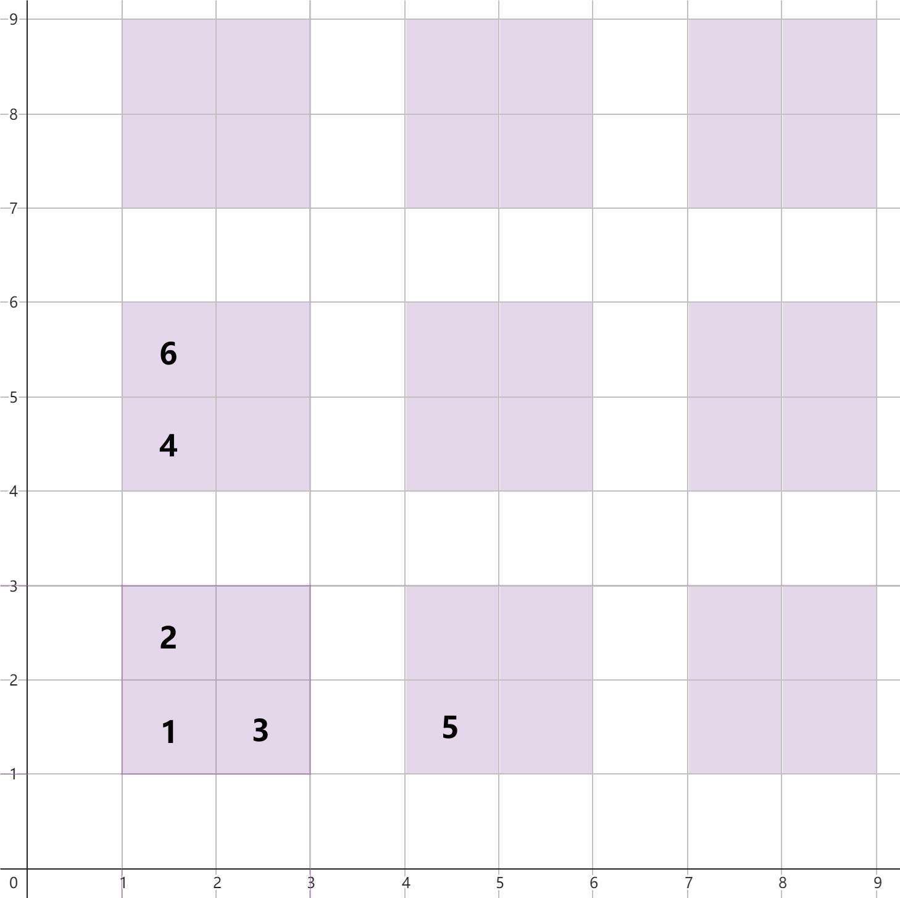

# C. Dining Hall

**time limit per test:** 2 seconds

**memory limit per test:** 512 megabytes

**input:** standard input

**output:** standard output

Inside the large kingdom, there is an infinite dining hall. It can be represented as a set of cells ($x, y$), where $x$ and $y$ are non-negative integers. There are an infinite number of tables in the hall. Each table occupies four cells ($3x + 1, 3y + 1$), ($3x + 1, 3y + 2$), ($3x + 2, 3y + 1$), ($3x + 2, 3y + 2$), where $x$ and $y$ are arbitrary non-negative integers. All cells that do not belong to any of the tables are corridors.

There are $n$ guests that come to the dining hall one by one. Each guest appears in the cell $(0, 0)$ and wants to reach a table cell. In one step, they can move to any neighboring by side corridor cell, and in their last step, they must move to a neighboring by side a free table cell. They occupy the chosen table cell, and no other guest can move there.

Each guest has a characteristic $t_i$, which can either be $0$ or $1$. They enter the hall in order, starting to walk from the cell ($0, 0$). If $t_i=1$, the $i$-th guest walks to the nearest vacant table cell. If $t_i=0$, they walk to the nearest table cell that belongs to a completely unoccupied table. Note that other guests may choose the same table later.

The distance is defined as the smallest number of steps needed to reach the table cell. If there are multiple table cells at the same distance, the guests choose the cell with the smallest $x$, and if there are still ties, they choose among those the cell with the smallest $y$.

For each guest, find the table cell which they choose.

#### Input

The first line contains a single integer $q$ ($1 \leq q \leq 5000$) — the number of test cases. Then follows their description.

The first line of each test case contains a single integer $n$ ($1 \leq n \leq 50\,000$) — the number of guests.

The second line of each test case contains $n$ integers $t_1, t_2, \ldots, t_n$ ($t_i \in \{0, 1\}$) — the characteristics of the guests.

It is guaranteed that the sum of $n$ for all test cases does not exceed $50\,000$.

#### Output

For each test case, output $n$ lines — for each guest, the cell where they sit.

#### Example

#### Input
```
2
6
0 1 1 0 0 1
5
1 0 0 1 1
```

#### Output
```
1 1
1 2
2 1
1 4
4 1
1 5
1 1
1 4
4 1
1 2
2 1
```

#### Note

Consider the first test case:

The distance from the first guest to the cell ($1, 1$) is $2$, so he sits there.

The distance from the second guest to the cell ($1, 2$) is $3$, as is the distance to the cell ($2, 1$), but since the first coordinate is smaller for the first option, he will choose it.

The distance from the third guest to the cell ($2, 1$) is $3$, so he will choose it.

The distance from the fourth guest to the cell ($1, 4$) is $5$, and he will choose it.

The distance from the fifth guest to the cell ($4, 1$) is $5$.

The distance from the sixth guest to the cell ($1, 5$) is $6$, as is the distance to the cell ($2, 2$), but since the first coordinate is smaller, he will choose the first option.



