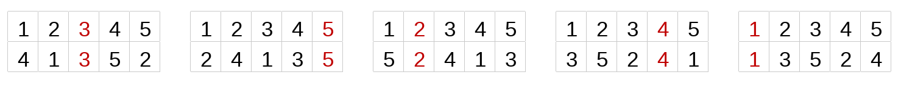

# C. Combination Lock

**time limit per test:** 2 seconds

**memory limit per test:** 256 megabytes

**input:** standard input

**output:** standard output

At the IT Campus "NEIMARK", there are several top-secret rooms where problems for major programming competitions are developed. To enter one of these rooms, you must unlock a circular lock by selecting the correct code. This code is updated every day.

Today's code is a permutation$^{\text{∗}}$ of the numbers from $1$ to $n$, with the property that in every cyclic shift$^{\text{†}}$ of it, there is exactly one fixed point. That is, in every cyclic shift, there exists exactly one element whose value is equal to its position in the permutation.

Output any valid permutation that satisfies this condition. Keep in mind that a valid permutation might not exist, then output $-1$.

$^{\text{∗}}$A permutation is defined as a sequence of length $n$ consisting of integers from $1$ to $n$, where each number appears exactly once. For example, (2 1 3), (1), (4 3 1 2) are permutations; (1 2 2), (3), (1 3 2 5) are not.

$^{\text{†}}$A cyclic shift of an array is obtained by moving the last element to the beginning of the array. A permutation of length $n$ has exactly $n$ cyclic shifts.

#### Input

Each test contains multiple test cases. The first line contains the number of test cases $t$ ($1 \leq t \leq 500$). The description of the test cases follows.

A single line of each test case contains a single integer $n$ ($1 \leq n \leq 2 \cdot 10^5$).

It is guaranteed that the sum of $n$ over all test cases does not exceed $2 \cdot 10^5$.

#### Output

For each test case, output the desired permutation. If multiple solutions exist, output any one of them. If no suitable permutations exist, output $-1$.

#### Example

#### Input
```
3
4
5
3
```

#### Output
```
-1
4 1 3 5 2
1 3 2
```

#### Note

In the second example, there is a permutation such that in each cyclic shift there is a fixed point (highlighted in dark red):





The first line contains the element numbers, and the second line contains all the shifts of the desired permutation.
