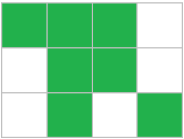
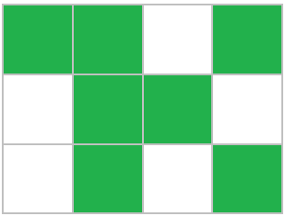

# D. Place of the Olympiad

**time limit per test:** 1 second

**memory limit per test:** 256 megabytes

**input:** standard input

**output:** standard output

For the final of the first Olympiad by IT Campus "NEIMARK", a rectangular venue was prepared. You may assume that the venue is divided into $n$ rows, each containing $m$ spots for participants' desks. A total of $k$ participants have registered for the final, and each participant will sit at an individual desk. Now, the organizing committee must choose the locations for the desks in the venue.

Each desk occupies one of the $m$ spots in a row. Moreover, if several desks occupy consecutive spots in the same row, we call such a group of desks a bench, and the number of desks in the group is the bench's length. For example, seating $7$ participants on a $3 \times 4$ venue (with $n = 3, m = 4$) can be arranged as follows:





In the figure above, the first row has one bench of length $3$, the second row has one bench of length $2$, and the third row has two benches of length $1$.

The organizing committee wants to choose the locations so that the length of the longest bench is as small as possible. In particular, the same $7$ desks can be arranged in a more optimal way, so that the lengths of all benches do not exceed $2$:





Given the integers $n$, $m$, and $k$, determine the minimum possible length of the longest bench.

#### Input

Each test contains multiple test cases. The first line contains the number of test cases $t$ ($1 \leq t \leq 10^4$). The description of the test cases follows.

A single line of each test case contains three positive integers — $n$, $m$, $k$ ($1 \leq n, m, k \leq 10^9$, $k \leq n\cdot m$).

#### Output

For each test case, output a single number — the minimum possible length of the longest bench.

#### Example

#### Input
```
5
3 4 7
5 5 5
1 13 2
2 4 7
1 5 4
```

#### Output
```
2
1
1
4
2
```
