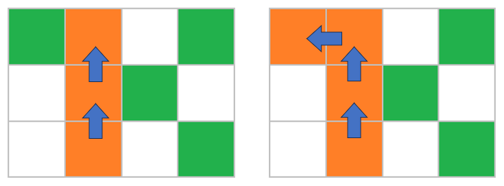
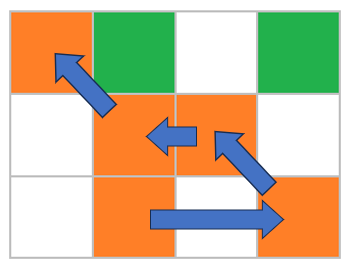

# F. Igor and Mountain

**time limit per test:** 5 seconds

**memory limit per test:** 512 megabytes

**input:** standard input

**output:** standard output

The visitors of the IT Campus "NEIMARK" are not only strong programmers but also physically robust individuals! Some practice swimming, some rowing, and some rock climbing!

Master Igor is a prominent figure in the local rock climbing community. One day, he went on a mountain hike to ascend one of the peaks. As an experienced climber, Igor decided not to follow the established trails but to use his skills to climb strictly vertically.

Igor found a rectangular vertical section of the mountain and mentally divided it into $n$ horizontal levels. He then split each level into $m$ segments using vertical partitions. Upon inspecting these segments, Igor discovered convenient protrusions that can be grasped (hereafter referred to as holds). Thus, the selected part of the mountain can be represented as an $n \times m$ rectangle, with some cells containing holds.

Being an experienced programmer, Igor decided to count the number of valid routes. A route is defined as a sequence of distinct holds. A route is considered valid if the following conditions are satisfied:

- The first hold in the route is located on the very bottom level (row $n$);
- The last hold in the route is located on the very top level (row $1$);
- Each subsequent hold is not lower than the previous one;
- At least one hold is used on each level (i.e., in every row of the rectangle);
- At most two holds are used on each level (since Igor has only two hands);
- Igor can reach from the current hold to the next one if the distance between the centers of the corresponding sections does not exceed Igor's arm span.

Igor's arm span is $d$, which means he can move from one hold to another if the Euclidean distance between the centers of the corresponding segments does not exceed $d$. The distance between sections ($i_1, j_1$) and ($i_2, j_2$) is given by $\sqrt{(i_1 - i_2) ^ 2 + (j_1 - j_2) ^ 2}$.

Calculate the number of different valid routes. Two routes are considered different if they differ in the list of holds used or in the order in which these holds are visited.

#### Input

Each test contains multiple test cases. The first line contains the number of test cases $t$ ($1 \leq t \leq 10^3$). The description of the test cases follows.

The first line of each test case contains three integers $n$, $m$, $d$ ($2 \leq n \leq 2000$, $1 \leq m, d \leq 2000$).

Each of the following $n$ lines contains $m$ characters — the description of the corresponding level of the mountain. The symbol '#' represents an empty section, and the symbol 'X' represents a section with a hold. The levels are described from top to bottom.

It is guaranteed that the sum of $n \cdot m$ over all test cases does not exceed $4 \cdot 10^6$.

#### Output

For each test case, output the number of different routes modulo $998244353$.

#### Example

#### Input
```
3
3 4 1
XX#X
#XX#
#X#X
3 4 2
XX#X
#XX#
#X#X
3 1 3
X
X

```

#### Output
```
2
60
0
```

#### Note

Possible routes in the first case:





In the second example, Igor's arm span has become larger, so new routes are available to him, for example this one:





In the third example, there are no holds on the lower level, so there are no correct routes.
