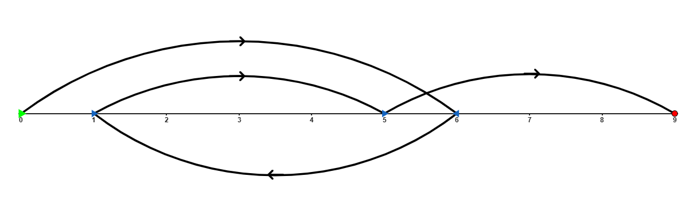

# G. Gleb and Boating

**time limit per test:** 3 seconds

**memory limit per test:** 256 megabytes

**input:** standard input

**output:** standard output

Programmer Gleb frequently visits the IT Campus "NEIMARK" to participate in programming training sessions.

Not only is Gleb a programmer, but he is also a renowned rower, so he covers part of his journey from home to the campus by kayaking along a river. Assume that Gleb starts at point $0$ and must reach point $s$ (i.e., travel $s$ meters along a straight line). To make the challenge tougher, Gleb has decided not to go outside the segment $[0, s]$. The dimensions of the kayak can be neglected.

Gleb is a strong programmer! Initially, his power is $k$. Gleb's power directly affects the movement of his kayak. If his current power is $x$, then with one paddle stroke the kayak moves $x$ meters in the current direction. Gleb can turn around and continue moving in the opposite direction, but such a maneuver is quite challenging, and after each turn, his power decreases by $1$. The power can never become $0$ — if his current power is $1$, then even after turning it remains $1$. Moreover, Gleb cannot make two turns in a row — after each turn, he must move at least once before making another turn. Similarly, Gleb cannot make a turn immediately after the start — he must first perform a paddle stroke.

Gleb wants to reach point $s$ from point $0$ without leaving the segment $[0, s]$ and while preserving as much power as possible. Help him — given the value $s$ and his initial power $k$, determine the maximum possible power he can have upon reaching point $s$.

#### Input

Each test contains multiple test cases. The first line contains the number of test cases $t$ ($1 \leq t \leq 100$). The description of the test cases follows.

A single line of each test case contains two integers $s$ and $k$ ($1 \leq s \leq 10^9$, $1 \leq k \leq 1000$, $k \leq s$).

It is guaranteed that the sum of $k$ over all test cases does not exceed $2000$.

#### Output

For each test case, output the maximum possible power Gleb can have at the end of his journey.

#### Example

#### Input
```
8
9 6
10 7
24 2
123456 777
6 4
99 6
10 4
99 4
```

#### Output
```
4
1
2
775
1
4
2
2
```

#### Note

One of the variants of Gleb's movement in the first example:



