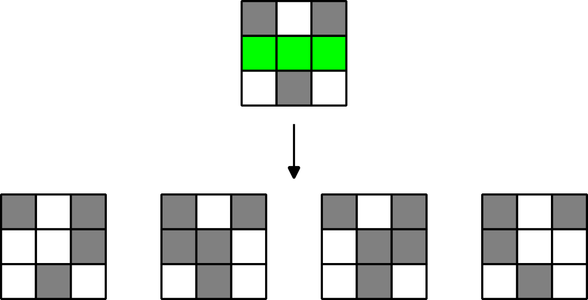

# E. She knows...

**time limit per test:** 2 seconds

**memory limit per test:** 256 megabytes

**input:** standard input

**output:** standard output

D. Pippy is preparing for a "black-and-white" party at his home. He only needs to repaint the floor in his basement, which can be represented as a board of size $n \times m$.

After the last party, the entire board is painted green, except for some $k$ cells $(x_1, y_1), (x_2, y_2), \ldots, (x_k, y_k)$, each of which is painted either white or black. For the upcoming party, D. Pippy wants to paint each of the remaining green cells either black or white. At the same time, he wants the number of pairs of adjacent cells with different colors on the board to be even after repainting.

Formally, if $$A = \left\{((i_1, j_1), (i_2, j_2)) \ | \ 1 \le i_1, i_2 \le n, 1 \le j_1, j_2 \le m, i_1+j_1 \lt i_2+j_2, |i_1-i_2|+|j_1-j_2| = 1, \operatorname{color}(i_1, j_1) \neq \operatorname{color}(i_2, j_2) \right\},$$ where $\operatorname{color}(x, y)$ denotes the color of the cell $(x, y)$, then it is required that $|A|$ be even.

Help D. Pippy find the number of ways to repaint the floor so that the condition is satisfied. Since this number can be large, output the remainder of its division by $10^9 + 7$.

#### Input

Each test consists of several test cases. The first line of the input data contains one integer $t$ ($1 \le t \le 10^4$) — the number of test cases. The description of the test cases follows.

The first line of each test case contains three integers $n, m, k$ ($3 \le n, m \le 10^9$; $1 \le k \le 2 \cdot 10^5$) — the dimensions of the board and the number of cells that are initially not green.

In the $i$-th of the following $k$ lines of each test case, there are three integers $x_i, y_i$ and $c_i$ ($1 \le x_i \le n; 1 \le y_i \le m$; $c_i \in \{0, 1\}$) — the coordinates of the cell and its color (if white, then $c_i = 0$; if black, then $c_i = 1$). It is guaranteed that all cells are distinct.

It is guaranteed that the sum of $k$ across all test cases does not exceed $2 \cdot 10^5$.

#### Output

For each test case, output a single integer — the answer modulo $10^9 + 7$.

#### Example

#### Input
```
2
3 3 6
1 1 0
1 2 1
1 3 0
3 1 1
3 2 0
3 3 1
3 4 12
1 1 0
1 2 1
1 3 0
1 4 1
2 1 1
2 2 0
2 3 1
2 4 0
3 1 0
3 2 1
3 3 0
3 4 1
```

#### Output
```
4
0
```

#### Note

In the first test case, there are exactly $4$ ways to paint the green cells $(2, 1), (2, 2), (2, 3)$, namely: $(1, 1, 0), (0, 0, 1), (1, 0, 0), (0, 1, 1)$ (the colors are indicated in the same order as the cells), as shown below.




 Example 1.
In the second test case, all cells of the board are already painted, and the number of pairs of adjacent cells with different colors on the board is odd, so the answer is zero.
