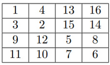

# D. Skibidi Table

**time limit per test:** 2 seconds

**memory limit per test:** 256 megabytes

**input:** standard input

**output:** standard output

Vadim loves filling square tables with integers. But today he came up with a way to do it for fun! Let's take, for example, a table of size $2 \times 2$, with rows numbered from top to bottom and columns numbered from left to right. We place $1$ in the top left cell, $2$ in the bottom right, $3$ in the bottom left, and $4$ in the top right. That's all he needs for fun!

Fortunately for Vadim, he has a table of size $2^n \times 2^n$. He plans to fill it with integers from $1$ to $2^{2n}$ in ascending order. To fill such a large table, Vadim will divide it into $4$ equal square tables, filling the top left one first, then the bottom right one, followed by the bottom left one, and finally the top right one. Each smaller table will be divided into even smaller ones as he fills them until he reaches tables of size $2 \times 2$, which he will fill in the order described above.

Now Vadim is eager to start filling the table, but he has $q$ questions of two types:

- what number will be in the cell at the $x$-th row and $y$-th column;
- in which cell coordinates will the number $d$ be located.
 Help answer Vadim's questions.

#### Input

Each test consists of several sets of input data. The first line contains a single integer $t$ $(1 \leq t \leq 10)$  — the number of sets of input data. The following lines describe the input data sets.

In the first line of each data set, there is an integer $n$, describing the size of the table $(1 \le n \le 30)$.

In the second line of each data set, there is an integer $q$  — the number of questions $(1 \le q \le 20\,000)$.

In the following $q$ lines of each data set, the questions are described in the following formats:

- -> x y  — What number will be in the cell $(1 \le x, y \le 2^n)$;
- <- d  — In which cell coordinates will the number $(1 \le d \le 2^{2n})$ be located.

It is guaranteed that the sum of $q$ over all test cases does not exceed $20\,000$.

#### Output

Output the answers to each question on a separate line.

#### Example

#### Input
```
2
2
5
-> 4 3
<- 15
<- 4
-> 3 1
-> 1 3
1
8
-> 1 1
-> 1 2
-> 2 1
-> 2 2
<- 1
<- 2
<- 3
<- 4
```

#### Output
```
7
2 3
1 2
9
13
1
4
3
2
1 1
2 2
2 1
1 2
```

#### Note

This is how the filled table from the first example looks:



