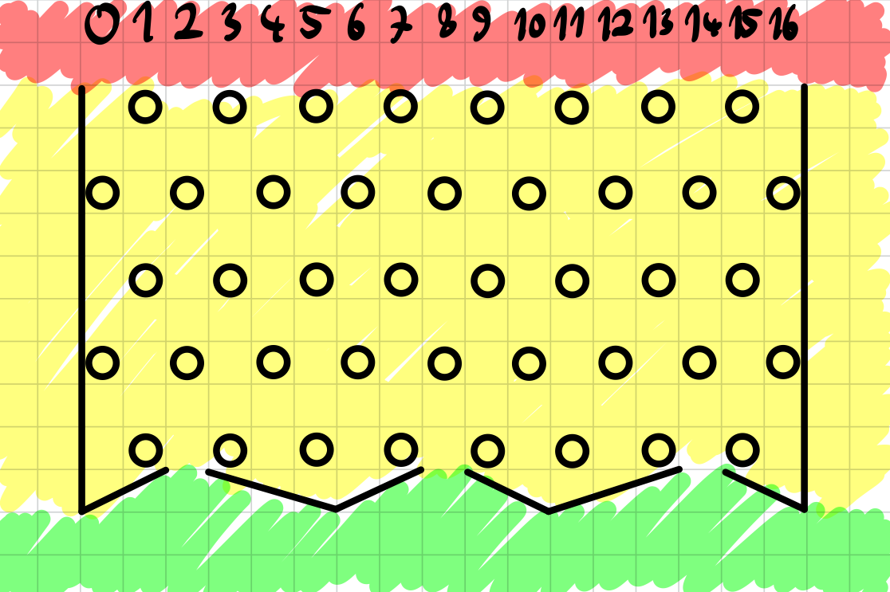

# B. Plinko

**time limit per test:** 1 second

**memory limit per test:** 256 megabytes

**input:** standard input

**output:** standard output





Can you win 10 times?

#### Input

The only line contains the text "$\texttt{Game}~x$", where $x$ is an integer between $1$ and $10$ (inclusive) — the number of the current round of the game.

#### Output

Output a single integer representing the number of the column you want to drop into.

#### Examples

#### Input
```
Game 1
```

#### Output
```
​​
```

#### Input
```
Game 2
```

#### Output
```
​
```
