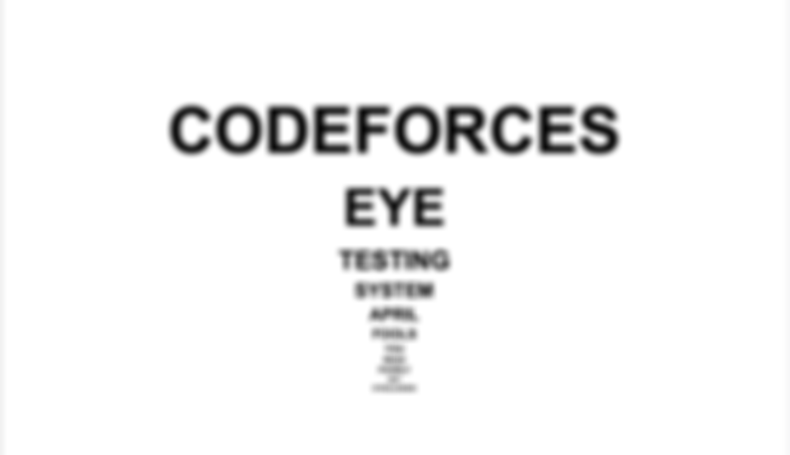

# H. Blurry Vision

**time limit per test:** 1 second

**memory limit per test:** 256 megabytes

**input:** standard input

**output:** standard output




Please direct your vision to line number $x$.

Now, read the word you see on that line.

If you struggle, I might have to prescribe eyeglasses.

#### Input

The only line contains one integer $x$ ($1 \leq x \leq 11$) — the line number.

#### Output

Output the word on line number $x$.

#### Example

#### Input
```
1
```

#### Output
```
CODEFORCES
```

#### Note

If you fail to read the first line, even glasses won't save you.
