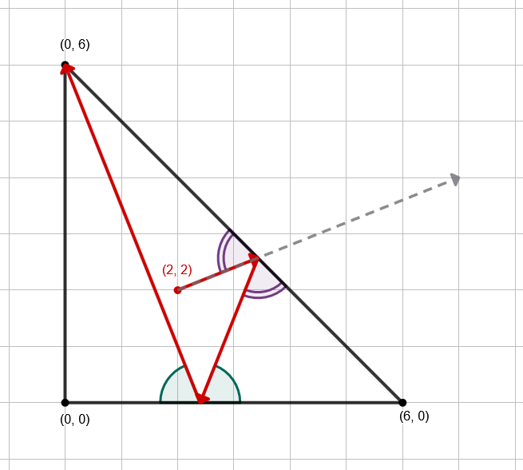
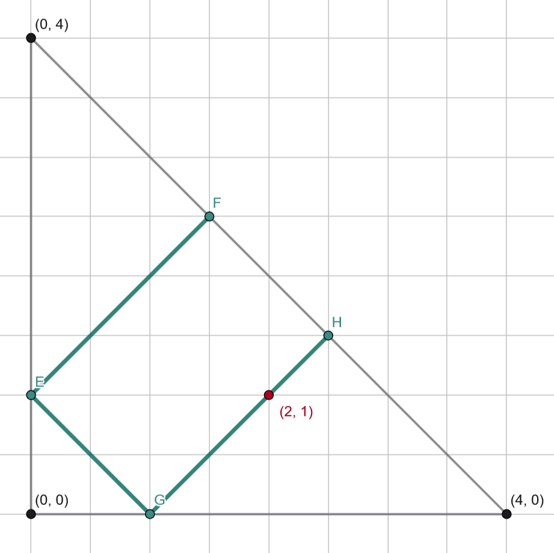

# C. Bermuda Triangle

**time limit per test:** 2 seconds

**memory limit per test:** 256 megabytes

**input:** standard input

**output:** standard output

The Bermuda Triangle — a mysterious area in the Atlantic Ocean where, according to rumors, ships and airplanes disappear without a trace. Some blame magnetic anomalies, others — portals to other worlds, but the truth remains hidden in a fog of mysteries.

A regular passenger flight 814 was traveling from Miami to Nassau on a clear sunny day. Nothing foreshadowed trouble until the plane entered a zone of strange flickering fog. Radio communication was interrupted, the instruments spun wildly, and flashes of unearthly light flickered outside the windows.

For simplicity, we will assume that the Bermuda Triangle and the airplane are on a plane, and the vertices of the triangle have coordinates $(0, 0)$, $(0, n)$, and $(n, 0)$. Initially, the airplane is located at the point $(x, y)$ strictly inside the Bermuda Triangle and is moving with a velocity vector $(v_x, v_y)$. All instruments have failed, so the crew cannot control the airplane.

The airplane can escape from the triangle if it ever reaches exactly one of the vertices of the triangle. However, if at any moment (possibly non-integer) the airplane hits the boundary of the triangle (but not at a vertex), its velocity vector is immediately reflected relative to that side$^\dagger$, and the airplane continues to move in the new direction.

Determine whether the airplane can ever escape from the Bermuda Triangle (i.e., reach exactly one of its vertices). If this is possible, also calculate how many times before that moment the airplane will hit the boundary of the triangle (each touch of the boundary, even at the same point, counts; crossing a vertex does not count).

$^\dagger$ Reflection occurs according to the usual laws of physics. The angle of incidence equals the angle of reflection.

#### Input

Each test contains multiple test cases. The first line contains the number of test cases $t$ ($1 \le t \le 10^4$). The description of the test cases follows.

The only line of each test case contains five integers $n$, $x$, $y$, $v_x$, and $v_y$ ($3 \le n \le 10^9$, $1 \le x, y$, $x+y \lt n$, $1 \le v_x, v_y \le 10^9$) — numbers describing the vertices of the triangle, the initial coordinates of the airplane, and the initial velocity vector.

#### Output

For each test case, output a single integer — the number of times the airplane will hit the boundary of the triangle before it escapes. If the airplane never escapes from the triangle, output $-1$.

#### Example

#### Input
```
6
6 2 2 5 2
6 2 2 20 8
4 1 2 1 1
4 1 1 1 2
4 1 1 2 1
6 2 3 2 3
```

#### Output
```
2
2
-1
-1
-1
5
```

#### Note

An illustration for the first test case is provided below:





In the second test case, the answer is the same as in the first, as all initial data, except for the speed, are the same, but the airplanes are initially moving in the same direction.

In the third test case, the answer is $-1$, as the airplane will move exclusively along the segments marked in green. An illustration is provided below:



