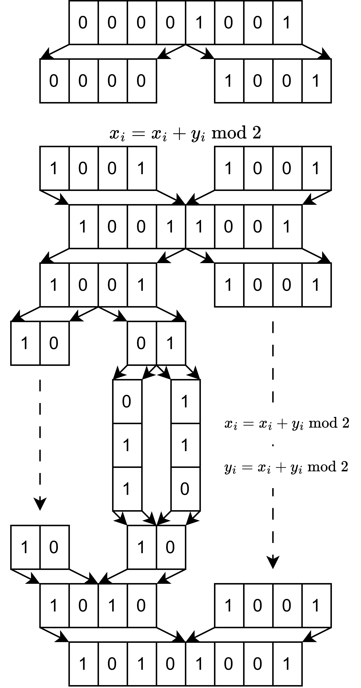

# D. Homework

**time limit per test:** 2 seconds

**memory limit per test:** 256 megabytes

**input:** standard input

**output:** standard output

Some teachers work at the educational center "Sirius" while simultaneously studying at the university. In this case, the trip does not exempt them from completing their homework, so they do their homework right on the plane. Artem is one of those teachers, and he was assigned the following homework at the university.

With an arbitrary string $a$ of even length $m$, he can perform the following operation. Artem splits the string $a$ into two halves $x$ and $y$ of equal length, after which he performs exactly one of three actions:

- For each $i \in \left\{ 1, 2, \ldots, \frac{m}{2}\right\}$ assign $x_i = (x_i + y_i) \bmod 2$;
- For each $i \in \left\{ 1, 2, \ldots, \frac{m}{2}\right\}$ assign $y_i = (x_i + y_i) \bmod 2$;
- Perform an arbitrary number of operations (the same operations defined above, applied recursively) on the strings $x$ and $y$, independently of each other. Note that in this case, the strings $x$ and $y$ must be of even length.
 After that, the string $a$ is replaced by the strings $x$ and $y$, concatenated in the same order.
Unfortunately, Artem fell asleep on the plane, so you will have to complete his homework. Artem has two binary strings $s$ and $t$ of length $n$, each consisting of $n$ characters 0 or 1. Determine whether it is possible to make string $s$ equal to string $t$ with an arbitrary number of operations.

#### Input

Each test contains multiple test cases. The first line contains the number of test cases $t$ ($1 \le t \le 10^5$). The description of the test cases follows.

The first line of each test case contains a single integer $n$ ($1 \le n \le 10^6$) — the length of the strings $s$ and $t$.

The second line of each test case contains the string $s$ of length $n$, consisting only of characters 0 and 1.

The third line of each test case contains the string $t$ of length $n$, consisting only of characters 0 and 1.

It is guaranteed that the sum of $n$ over all test cases does not exceed $10^6$.

#### Output

For each test case, output "Yes" (without quotes) if it is possible to make string $s$ equal to string $t$, and "No" otherwise.

You can output each letter in any case (lowercase or uppercase). For example, the strings "yEs", "yes", "Yes", and "YES" will be accepted as a positive answer.

#### Example

#### Input
```
3
8
00001001
10101001
8
00000000
00001001
6
010110
100010
```

#### Output
```
Yes
No
Yes
```

#### Note

In the first test case, the string 00001001 can be transformed into the string 10101001 in two operations. The sequence of actions is illustrated in the figure below:





In the second test case, the string 00000000 cannot be transformed into any string other than 00000000, as no non-zero elements can be formed during any operation.
